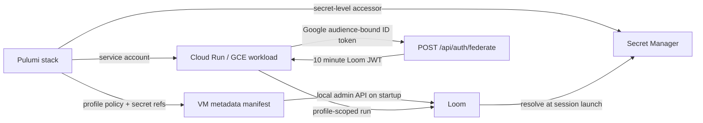

# Provisioning loom with Pulumi

This stack is the authoritative description of a single-host GCP loom. It
creates the VM and its supporting identity, network, storage, backup, image,
and GitHub Actions resources; [`post-up.py`](post-up.py) performs the few
bring-up checks that are observations rather than infrastructure.

The legacy [`../gcp/bootstrap.py`](../gcp/bootstrap.py) remains temporarily for
existing installations. Do not run it and Pulumi against the same resources
until those resources have been [imported](IMPORT.md).

## One-time state backend

Pulumi cannot create the bucket that contains the state of the update creating
that bucket. Bootstrap a dedicated versioned state bucket once (separate from
the runtime backup bucket), then use it for every operator and CI invocation:

```sh
export PROJECT=my-project
export STATE_BUCKET="${PROJECT}-loom-pulumi-state"
gcloud storage buckets create "gs://${STATE_BUCKET}" \
  --project="${PROJECT}" --location=us-central1 --uniform-bucket-level-access
gcloud storage buckets update "gs://${STATE_BUCKET}" \
  --versioning --public-access-prevention
pulumi login "gs://${STATE_BUCKET}"
```

Restrict bucket IAM to loom infrastructure operators and enable an organization
retention policy appropriate for your recovery requirements. This state holds
encrypted secrets and resource identifiers; the separate `<project>-loom-backups`
bucket holds database backups and is writable only by the VM service account.

## Configure and create

```sh
cd deploy/pulumi
python3 -m venv .venv
.venv/bin/pip install -r requirements.txt
pulumi stack init production \
  --secrets-provider='gcpkms://projects/<project>/locations/<location>/keyRings/<ring>/cryptoKeys/<key>'
pulumi config set gcp:project my-project
pulumi config set region us-central1
pulumi config set domain loom.example.com
pulumi config set operatorCidr 203.0.113.7/32
# See Pulumi.example.yaml for the optional settings.

# The complete rendered dotenv is stored as an encrypted Pulumi configuration
# value, then written as a new Secret Manager version by the stack.
pulumi config set --secret loomDotenv "$(loom config render-env --out -)"
pulumi up
./post-up.py --stack production
```

The KMS key in that command must already exist; the GCS state bucket stores only
ciphertext. Grant decrypt permission only to infrastructure operators. If using
the passphrase provider instead, keep `PULUMI_CONFIG_PASSPHRASE` in an access-
controlled secrets manager and test recovery from a fresh workstation. Losing
either the KMS key or passphrase makes the encrypted stack configuration
unrecoverable.

Set `dnsManagedZone` only to the name of an **existing Cloud DNS managed zone
whose nameservers are already delegated at the registrar**. Pulumi manages the
A record but deliberately does not create or delegate a DNS zone. When DNS is
hosted elsewhere, omit the setting, create an A record for the exported
`address`, and only then run `post-up.py`. Both the startup script and post-up
driver refuse to start Caddy until public DNS resolves to the reserved address,
preventing repeated failed ACME challenges.

The stack uses the configured existing VPC (`default` unless `network` is set).
It adds tagged Loom web and SSH rules, with Loom's SSH rule scoped to
`operatorCidr`; it deliberately does not inspect, remove, or override unrelated
firewall rules owned by the operator.

The protected address, data disk, secret, and backup bucket make an accidental
`pulumi destroy` fail rather than erase durable state. Remove protection only
during an explicitly planned teardown. The boot disk is disposable; the
separately attached data disk is retained when the VM is replaced.

## Runtime profiles and workload identities

Use one canonical public URL with no trailing slash. It is both the API base
and exact OIDC audience. Declare profiles, their Secret Manager references,
and workload bindings in `Pulumi.<stack>.yaml`; see
[`Pulumi.example.yaml`](Pulumi.example.yaml) for a complete `ops` profile with
Marin, Grafana, and GitHub Actions callers. Raw profile secret values are not
accepted by the stack. Pulumi grants the Loom VM access only to the named
secrets and places a non-secret reconciliation manifest in VM metadata.



On every startup generation, the VM waits for Loom readiness and runs `loom
deployment apply` against the local REST API. Reconciliation is idempotent and
prunes only profiles and identity mappings previously managed by the deployment
manifest; operator-created resources are left alone. A referenced secret is
resolved when a session launches or respawns, so rotating its Secret Manager
version does not require storing a value in SQLite or Pulumi state.

Each `workloads` entry creates a Google service account. Its immutable numeric
subject and exact email address are bound to one declared profile. Grant that
service account to the Cloud Run service (or other GCP workload), then consume
the non-secret `workloadClients` stack output. The stdlib-only Python helper
renews both sides of the exchange:

```python
from weaver_loom import Client, WorkloadCredentials

credentials = WorkloadCredentials("https://loom.example.com")
loom = Client(
    base="https://loom.example.com",
    credentials=credentials,
    capabilities=["launch"],
)
run = loom.run(
    "ops",
    idempotency_key="incident-2026-07-22",
    session={
        "repo": "marin-community/marin",
        "goal": "Investigate the production alert and report findings",
    },
    source="ops",
)
```

No long-lived Loom token is stored in the caller. The helper gets an
audience-bound Google identity token from the metadata server, exchanges it for
a ten-minute profile-scoped Loom JWT, refreshes before expiry with jitter, and
retries once after a 401. Revocation is immediate at the next exchange: remove
the workload mapping with `pulumi up`, or detach/disable its service account.

GitHub mappings are declared in `githubFederations`; use the repository's
numeric `repositoryId`, exact workflow ref, event, and branch ref. Set repository
variable `LOOM_URL` to the canonical stack URL and, if needed, set
`LOOM_PROFILE`. The opt-in
[`loom-issue.yml`](../../.github/workflows/loom-issue.yml) workflow then starts
one retry-safe run when the `loom` label is added to an issue. It requests only
`contents: read` and `id-token: write`; no long-lived Loom credential is stored
in GitHub. Run `loom federation ls`, `loom profile show ops`, and `pulumi stack
output workloadClients` to audit the effective non-secret configuration.

For prompt-driven GitHub mutations, declare the stock-compatible
`github_comment` profile shown in `Pulumi.example.yaml`, including a
least-privilege CI token as the `GH_TOKEN` Secret Manager reference. Bind each
approved caller's exact workflow to only that profile. The workflow sends its
complete task in `session.goal`; no editorial policy lives in the Loom profile,
and Loom keeps the token server-side behind fixed GitHub tools.
See [Restricted GitHub sessions](../../docs/restricted-sessions.md) for the
exchange and rollout checklist.

## Operations and debugging

The VM runs the Google Cloud Ops Agent and scrapes Loom's loopback-only
OpenMetrics endpoint every 30 seconds. Caddy deliberately returns 404 for the
public `/metrics` path. Pulumi also creates:

- a public HTTPS readiness uptime check at `/api/ready`;
- a two-minute readiness alert, with optional email channels from
  `alertEmails`; and
- a Cloud Monitoring dashboard for current sessions and automation runs,
  partitioned only by bounded status, profile, source, and mapped service labels.

Use `/api/health` for liveness and `/api/ready` for dependency readiness. An
authenticated administrator can open Settings → Diagnostics or request
`/api/diagnostics` for current session/run counts, database migration state,
task health, and process/runtime details. Diagnostics and metrics never include
branch names, paths, user IDs, workload subjects, tokens, or raw error text.

Useful first checks after a bring-up are:

```sh
curl -fsS https://loom.example.com/api/health
curl -fsS https://loom.example.com/api/ready
gcloud compute ssh loom --zone=us-central1-a \
  --command='sudo systemctl status google-cloud-ops-agent; journalctl -u google-cloud-ops-agent -n 100'
gcloud compute ssh loom --zone=us-central1-a \
  --command='curl -fsS http://127.0.0.1:7878/metrics | head'
```

## Backups

Two independent recovery mechanisms are installed:

- A daily Compute Engine snapshot policy retains data-disk snapshots for 14
  days by default.
- `loom-backup.timer` runs nightly on the VM. It invokes SQLite's online
  `.backup` API inside the loom container, runs `PRAGMA quick_check`, compresses
  the result, and uploads it to the versioned backup bucket. Objects expire
  after 30 days by default.

Inspect or run the portable backup manually with:

```sh
gcloud compute ssh loom --zone=us-central1-a \
  --command='systemctl status loom-backup.timer; sudo systemctl start loom-backup.service'
```

Restore only with the stack fully stopped. After downloading and decompressing
a selected object on the VM, validate it first, then use the loom image as root
so the named volume, configured app UID/GID, and file mode are handled
correctly:

```sh
cd /opt/loom/deploy/standalone
docker compose run --rm --no-deps --user root --entrypoint sqlite3 \
  -v /path/to/restored.sqlite:/restore/weaver.db:ro loom \
  /restore/weaver.db 'PRAGMA quick_check;'  # must print: ok
docker compose down
docker compose run --rm --no-deps --user root --entrypoint sh \
  -v /path/to/restored.sqlite:/restore/weaver.db:ro loom -ceu '
    state=/home/app/.weaver
    saved="$state/pre-restore-$(date -u +%Y%m%dT%H%M%SZ)"
    mkdir -p "$saved"
    for file in weaver.db weaver.db-wal weaver.db-shm; do
      if [ -e "$state/$file" ]; then mv "$state/$file" "$saved/$file"; fi
    done
    install -o app -g app -m 0600 /restore/weaver.db "$state/weaver.db"
  '
docker compose up -d
LOOM_DOMAIN="$(curl -fsS -H 'Metadata-Flavor: Google' \
  http://metadata.google.internal/computeMetadata/v1/instance/attributes/loom-domain)"
curl -fsS "https://${LOOM_DOMAIN}/api/health"  # must print: ok
```

Moving the old DB and its WAL/SHM sidecars together prevents stale WAL pages
from being replayed into the restored database and keeps a rollback copy in the
volume. Do not restore over a running server.

## Deployment images

Pulumi creates a repository-scoped Workload Identity Federation provider and a
service account that can only write Artifact Registry images. Configure these
GitHub repository variables from `pulumi stack output`:

| Variable | Value |
|---|---|
| `LOOM_GCP_PROJECT` | GCP project id |
| `LOOM_GCP_REGION` | stack region |
| `LOOM_GCP_WIF_PROVIDER` | `githubWorkloadIdentityProvider` output |
| `LOOM_GCP_IMAGE_SERVICE_ACCOUNT` | `githubServiceAccount` output |
| `LOOM_URL` | canonical public URL, with no trailing slash |

On pushes to `main`, [the image workflow](../../.github/workflows/image.yml)
uses GitHub OIDC—no JSON key—to publish an immutable commit-SHA tag. The
repository rejects tag replacement and deliberately has no mutable `latest`.
Rerunning the workflow for an already-published commit detects the existing tag
and exits successfully without rebuilding or moving it.
Set `imageMode: pull`, pin `imageTag` to that SHA, and run `pulumi up` for a
reproducible rollout; then run `post-up.py` to stream the new startup
generation.

The example stack uses `imageMode: build` so the first deployment is
self-contained. Once that `pulumi up` has created WIF and Artifact Registry,
set the four repository variables, manually dispatch **Publish deployment
image**, and wait for it to finish. Then change `imageMode` to `pull`, set
`imageTag` to the published commit SHA, run `pulumi up`, and run `post-up.py`.
If a pull-mode VM boots before its selected image exists it fails safely and
the post-up retrigger completes it after the image is published.

## Validation

```sh
python3 -m compileall -q infrastructure.py post-up.py tests
shellcheck ../gcp/startup-script.sh ../gcp/backup-sqlite.sh
actionlint ../../.github/workflows/image.yml
.venv/bin/pip install -r requirements-dev.txt
.venv/bin/python -m pytest -q tests  # Pulumi mocks; no cloud credentials
pulumi preview                       # final provider/schema check
```
