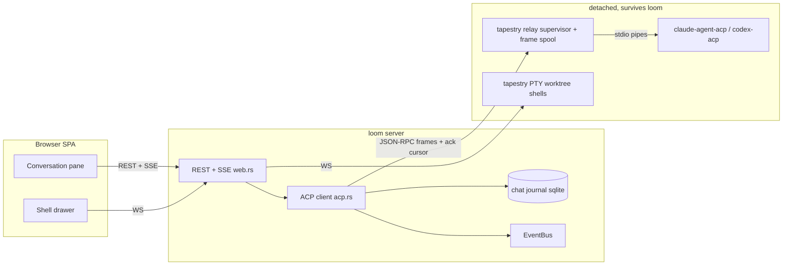
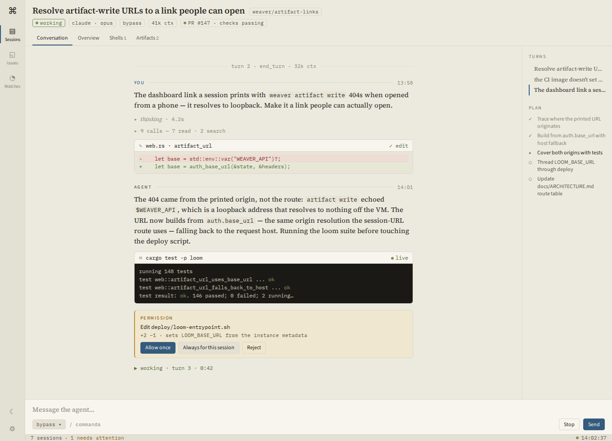
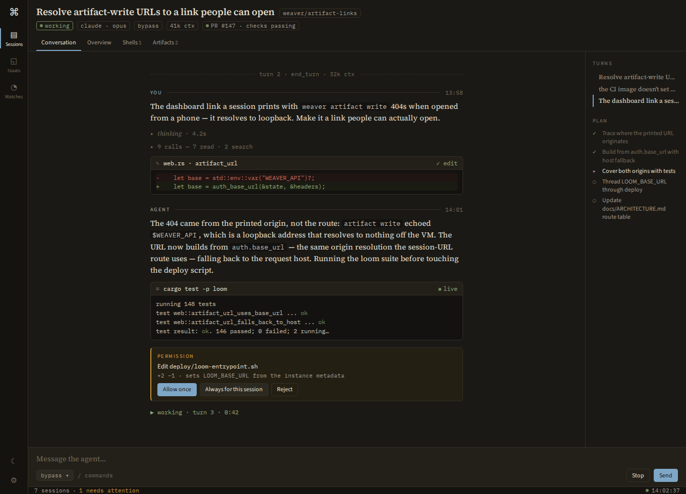

# Migrating session execution to the Agent Client Protocol

The design of record for moving agent sessions from the terminal-driven model
to [ACP](https://agentclientprotocol.com) (weaver issue #504): can the
terminal-driven agent model move to ACP, does the terminal survive as a
backstop, and what does the chat surface become? Nothing here ships yet; the
migration-plan phases are tracked as weaver issues #505–#512.

## Verdict

**Yes — migrate.** ACP replaces weaver's three most fragile mechanisms —
keystroke injection (`backend::paste` + Enter), screen scraping (vt100
`capture`), and post-hoc transcript parsing (`weaver_core::transcript` reading
Claude's `~/.claude/projects/*.jsonl` and Codex's rollout files) — with one
structured JSON-RPC stream that both of our first-class agents already speak
through adapters maintained by the ACP org/Zed. The terminal does **not**
disappear: it stays as the worktree escape hatch and as the unchanged backend
for custom agents (including the e2e `shell` agent). What goes away is only
the agent's TUI — and with it the bracketed-paste dance, the
Escape-to-interrupt convention, the hook-file lifecycle relay, and the "never
block on an interactive TUI prompt" rule (permission prompts become
answerable from the dashboard, which today's model structurally cannot do).

The shape of the migration: **loom becomes an ACP client**; the agent process
becomes a headless adapter subprocess under a detached tapestry *relay*
supervisor, so the survives-loom-restart invariant is preserved. The SPA's
terminal + conversation panes merge into one conversation-first surface fed
live over SSE instead of re-parsing JSONL at turn boundaries.

Honest cost framing up front: the relay supervisor — durable frame spool,
ack cursor, restart re-adoption — is the real engineering in this design,
not a trim of the existing PTY supervisor. It is priced accordingly in the
plan below.

## ACP in one page (the weaver-relevant facts)

- **Roles.** A *client* (an editor/host — here, loom) launches an *agent* (a
  coding agent) as a subprocess and speaks JSON-RPC 2.0 over stdio,
  newline-delimited. The client owns the environment and the UI; the agent
  owns the model loop. Remote transports (HTTP/WebSocket) are draft-stage
  only — but irrelevant here, since loom and the agent share a host; the
  browser keeps talking to loom's REST/SSE exactly as today (the
  API-first/thin-client rule holds).
- **Lifecycle.** `initialize` (capability negotiation) → `session/new {cwd,
  mcpServers}` → repeated prompt turns: `session/prompt` carries the user
  message; the agent streams `session/update` notifications — message/thought
  chunks, `tool_call` / `tool_call_update` (kind: read/edit/delete/move/
  search/execute/think/fetch; status: pending/in_progress/completed/failed;
  content including **diffs**; file locations for follow-along), `plan` (a
  checklist with per-entry status), `available_commands_update` (slash
  commands), `current_mode_update`, `usage_update` (tokens/cost) — and
  finally the prompt response with a **stop reason** (`end_turn`,
  `cancelled`, `refusal`, `max_tokens`, `max_turn_requests`).
  `session/cancel` interrupts a turn.
- **Permissions.** Before a gated tool runs, the agent calls
  `session/request_permission` with options (allow once/always, reject); the
  turn blocks on the client's answer. Modes (`session/set_mode`) select the
  gating posture.
- **Sessions persist — optionally.** Baseline ACP is only
  `session/new`/`prompt`/`cancel`/`update`; `session/load` (full history
  replay) and `session/resume` (reattach without replay) are optional
  capabilities. Both target adapters advertise them today, and the ids are
  the agents' own on-disk session ids (the same files we scrape now), so an
  adapter process can die and a new one can reopen the conversation. Draft
  ACP v2 replaces `load` with resume+replay — so adopt/recovery must sit
  behind a capability check and a seam, not assume `load` forever.
- **Client services.** The client may expose `fs/read_text_file`/
  `fs/write_text_file` (unsaved-editor-state access — loom has no editor
  buffers, so we don't advertise it) and `terminal/*` (client-executed
  commands). **`claude-agent-acp` uses neither for execution**: the Agent SDK
  runs Bash itself (inside the container's bubblewrap confinement) and
  streams command output through tool-call content plus a private
  `_meta.terminal_output` extension. So loom's client surface starts
  deliberately minimal: no fs, no terminal fulfillment — see "over-built"
  notes in the risks section.
- **Who speaks it.**
  - `claude-agent-acp` (npm `@agentclientprotocol/claude-agent-acp`,
    formerly zed-industries/claude-code-acp; actively released): wraps the
    Claude Agent SDK. Crucially it loads `settingSources: ["user",
    "project", "local"]` and merges settings-file hooks with its own — so
    weaver's `.claude/settings.local.json` hooks, the `WEAVER.md` primer via
    `SessionStart`, skills, and CLAUDE.md keep working unmodified. It
    advertises `loadSession` + `resume`, maps Claude Code permission modes
    (default/manual, acceptEdits, plan, bypassPermissions, …) onto ACP
    session modes, and routes `canUseTool` through ACP permission requests.
    Accepts Agent SDK options (model, `appendSystemPrompt`, permission mode)
    via `_meta.claudeCode.options`.
  - `codex-acp` (originally Zed's Rust adapter; development moved to
    `agentclientprotocol/codex-acp` on the Codex App Server, distributed via
    npm): session load/resume/close/list, slash commands, auth via
    `OPENAI_API_KEY` (what the deploy already threads).
  - Client-side implementation: the **`agent-client-protocol` Rust crate**
    (agentclientprotocol/rust-sdk). Note it was rewritten for 1.x (the 0.x
    trait API is gone; Zed pins an exact 1.x version with its unstable
    feature) — the spike targets the current 1.x API and pins it.

## What we run today (why it's brittle)

Every session is an interactive TUI (`claude`/`codex` —
`agent::claude_command`, `crates/loom/src/agent.rs`) inside a detached PTY
supervisor (`crates/tapestry/`): setsid'd `tapestry supervise`, portable-pty
+ vt100 emulator, unix control socket. Loom drives it blind:

- **Input** is keystroke forgery: `backend::paste` wraps text in
  bracketed-paste markers and follows with a synthesized Enter
  (`crates/loom/src/backend.rs`) because Claude's TUI folds a bare `\r` into
  the composer.
- **Output** is a rendered screen: `preview` returns the vt100 grid as text;
  the live view is raw PTY bytes over WebSocket into xterm.js. Detached
  output that no viewer consumed is dropped — only the screen state
  survives.
- **History** is out-of-band forensics: `weaver_core::transcript` sniffs and
  parses the agent's own JSONL (Claude projects, Codex rollouts) into the
  iris model (`Text | Thinking | ToolUse | ToolResult | Image`), re-read
  after each turn boundary (the Conversation tab debounce-refetches on
  `status`/`tag` SSE edges).
- **Lifecycle** is a relay with one good source: Claude Code hooks shell out
  to `weaver hook`, which writes `events` rows the monitor promotes on its
  next tick. Codex and custom agents are hookless — they sit at `running`
  forever, with only a screen-hash bump for staleness; inferring
  working/idle from stillness was deliberately removed because it was wrong.
- **Interrupt** is `send_key(Escape)`. **Permissions** are pre-seeded away
  (`seed_claude_launch_gates`) because a TUI prompt would wedge a detached
  session; the workflow doc has to instruct agents "never block on an
  interactive TUI prompt".
- **Adopt** is Claude-only in practice: `claude --continue` resumes; codex
  adopt relaunches fresh, history lost to the new process. ACP
  load/resume makes recovery a first-class, agent-agnostic operation — for
  Codex that is a *new* capability, not parity.

The iris block model is already ACP-shaped — we built a read-only,
after-the-fact ACP out of scraping. The migration is largely *deleting*
mediation layers; the one genuinely new component is the relay supervisor.

## The mapping

| Today (mechanism) | Under ACP |
|---|---|
| `POST /send` → `backend::paste` + Enter | `session/prompt` (real request; response = turn end) |
| `POST /interrupt` → Escape keystroke | `session/cancel` |
| `GET /preview` → vt100 screen render | last N journal blocks rendered as text (CLI convenience only) |
| Conversation tab → parse agent JSONL per turn | live `session/update` stream, journaled as it arrives |
| Lifecycle: Claude settings-hooks → `weaver hook` → events → monitor tick | turn boundaries native to the protocol; exact for every ACP agent, Codex included |
| Hookless agents pinned at `running` | same turn-boundary lifecycle as Claude |
| `adopt` → `claude --continue` (codex: fresh relaunch) | respawn adapter → `session/load`/`resume` where advertised, fresh `session/new` + re-orientation otherwise |
| Permission prompts: structurally impossible (pre-seeded away) | `session/request_permission` → policy answer by default; interactive card in supervised modes |
| Plan/TODO: invisible (buried in TUI paint) | `plan` updates → structured checklist |
| Slash commands: typed blind into the TUI | `available_commands_update` → composer autocomplete |
| Model/mode switching: TUI-only menus | `session/set_mode`, adapter options — REST-exposed |
| Token/context usage: invisible | `usage_update` → header meter |
| Agent-run shell commands: invisible inside the TUI | tool-call content (kind `execute`) streamed into the transcript |

## Architecture



### Where the agent process lives

The invariant to preserve: *loom can be killed and restarted at any time*
(deploys do this constantly); agents must not die — or lose protocol state —
mid-turn. Three options:

- **A. Direct child of loom.** Simplest possible client. Rejected as the
  end-state: every deploy kills every in-flight turn; `session/load`
  recovers history but not the lost work. (Fine for the spike.)
- **B. Tapestry grows a relay mode — recommended.** A detached supervisor
  process, sharing tapestry's process scaffolding (setsid spawn, spec over
  stdin, unix control socket, process-group kill, alive/ping) but **not** a
  PTY and **not** a dumb byte pipe — a *frame relay with a spool*. To be
  clear about the cost: today's supervisor drops detached output and has no
  replay or ack machinery; all of the following is new work, and it is the
  hard core of this design.
  - The relay spawns the adapter over plain pipes and splits agent stdout
    into newline-delimited frames (no JSON parsing beyond the framing).
  - Every agent→client frame is appended to a per-session on-disk spool
    with a sequence number. Loom subscribes with a cursor and the relay
    replays every frame after it; loom acks frames **only up to the last
    block boundary it has durably journaled**, and the ack advances the
    spool's retention watermark. A crash mid-block therefore replays the
    partial block's chunk frames on reconnect and the block rebuilds —
    nothing is lost to "the dead client already consumed those bytes", and
    a disk spool truncated at the ack watermark has no overflow case.
  - An unanswered agent→client request (`session/request_permission`) is
    just an un-acked frame the reconnecting loom sees again; the JSON-RPC
    id travels in the frame, so the late answer is valid.
  - Loom's own outstanding request state does not survive its process, so
    it is persisted on the sessions row: the in-flight `session/prompt`
    request id + turn number (and any other outstanding client→agent ids).
    On reattach loom re-adopts the map, so the eventual turn-end response
    is recognized rather than dropped as an unknown id.
  - Adapter stderr goes to a per-session log file (surfaced in the UI —
    see below); exit status rides the supervisor's existing wait path.
  - Concretely: new socket opcodes (`SUBSCRIBE(cursor)` / `FRAME(seq)` /
    `ACK(seq)`) beside the PTY set.

  Orphan/adopt semantics carry over verbatim: supervisor dead → `orphaned`;
  adopt → respawn + `session/load` where advertised.
- **C. A detached host that is itself the ACP client** (answers
  permissions, journals updates, loom subscribes). Rejected: it would
  re-home policy and persistence outside the one process allowed to open
  the db, and duplicate loom's auth/policy machinery. The relay's ack
  cursor gives B the same crash-safety without moving any decision out of
  loom.

B keeps one supervisor concept for both backends — PTY mode for terminal
agents and worktree shells, relay mode for ACP agents — and the monitor's
orphan detection (`backend::has_session`) doesn't change at all.

### Launch mapping

`session/new` carries only `cwd` + `mcpServers` (plus `_meta`) — none of the
things `claude_command` passes as argv today. The mapping:

- **Goal prompt** → the first `session/prompt` after setup, journaled as the
  session's first `user_message` block. The launch prompt finally becomes a
  real prompt instead of a shell-quoted argv splice.
- **Model / effort** (real session columns, real UI controls) →
  `_meta.claudeCode.options` for the Claude adapter; `CODEX_CONFIG` (a JSON
  object merged into the Codex session config: `model`,
  `model_reasoning_effort`) for codex-acp.
- **System primer**: the worktree path keeps riding the `SessionStart`
  settings hook exactly as today; the paths that use
  `--append-system-prompt-file` (concierge, adopt re-orientation) map to the
  Claude adapter's `appendSystemPrompt` option. Codex has no analogue, so a
  primer-only codex launch seeds the primer positionally, as its terminal
  path does.
- **Permission posture** → the session's launch mode (below). The Claude
  adapter takes it via `_meta` permissionMode; codex-acp boots in
  `INITIAL_AGENT_MODE` (`read-only` | `agent` | `agent-full-access`, mapped
  from the claude-flavored vocabulary, codex ids passing through).
- **Codex auth** → `DEFAULT_AUTH_REQUEST={"methodId":"api-key"}` +
  `OPENAI_API_KEY` (already threaded by the deploy), headless.

Anything an adapter can't take via the protocol falls back to env/config
files — the same out-of-band channel the launch env (`WEAVER_API`,
`WEAVER_BRANCH`, `LOOM_TOKEN`) already uses.

### Persisting the stream: the chat journal

New loom-owned table (created in `migrate_loom`, like the other loom tables):

```
chat_blocks(id, session_id, turn, seq, kind, payload TEXT (JSON), created_at,
            UNIQUE(session_id, turn, seq))
```

`kind` ∈ `user_message | agent_message | thought | tool_call | plan |
permission_request | mode_change | usage | turn_end`. Loom's ACP client
consolidates chunk deltas in memory and writes a row per *block* (a message,
a tool call reaching a terminal state, a permission resolution, a turn end)
— blocks, not per-token deltas. Payloads carry the upstream ids
(`toolCallId`, permission request id), so every write and any replay
ingestion is idempotent. Recovery is layered: the relay spool (ack cursor =
last journaled block) is the primary, exactly-once path; `session/load`
reconciliation at adopt — idempotent on upstream ids, journal winning
mid-turn — is the belt-and-braces repair for spool loss.

Live deltas ride a per-session in-memory broadcast →
`GET /api/sessions/{id}/chat/stream` (SSE). A client renders by fetching
`GET /api/sessions/{id}/chat` (the journal) and then applying stream deltas
— the same snapshot+tail pattern the terminal WS uses today.

Archive capture (`chatlog::capture`) maps the journal to iris `chat.json` +
`chat.md`, so `weaver chatlog`, the archived-conversation viewer, and the
iris toolchain keep working; ACP-only kinds (plan, permission, usage)
flatten to context blocks in the export. The JSONL scrape path remains as
the fallback for terminal-backend sessions.

### New/changed REST surface (API-first, CLI parity)

| Route | Purpose |
|---|---|
| `POST /api/sessions/{id}/prompt` | send a user message (`session/prompt`); queues when a turn is in flight — `loom session send` maps here for ACP sessions |
| `POST /api/sessions/{id}/interrupt` | unchanged route, now `session/cancel` |
| `GET /api/sessions/{id}/chat` + `/chat/stream` | journal + SSE deltas |
| `POST /api/sessions/{id}/permissions/{request_id}` | answer `{option_id}` — also grantable to watches as a capability |
| `PUT /api/sessions/{id}/mode` | `session/set_mode` |
| `GET /api/sessions/{id}/preview` | ACP sessions: last N journal blocks as plain text — CLI convenience, nothing more |

Queued prompts are durable and simple: the existing `pending_prompt` column
holds the queue (sends during a turn append as paragraphs, each audited as a
`nudge` event, clearable from the UI); it dispatches as one `session/prompt`
at the next turn boundary. Cancel stops the in-flight turn and leaves the
queue. `SessionView` grows `protocol: "terminal" | "acp"`, `acp_session_id`,
`current_mode`, `usage`. Note the session-scoped `/chat` routes are distinct
from the fleet-level concierge `/api/chat` (`docs/plans/meta-chat.md`) — and
the UI keeps the *Conversation* name precisely so the concierge keeps
"Chat".

### Lifecycle & status

For ACP sessions the hook relay is redundant: prompt-in-flight ⇒ clear
`idle` (the `working` edge), stop reason ⇒ stamp the quiet `idle` mark (the
finished turn). Today `weaver_core::agent::hooks_json` installs
`SessionStart`/`UserPromptSubmit`/`Notification`/`Stop` as one bundle; for
ACP sessions `install_hooks` writes **only `SessionStart`** (primer +
compaction re-orientation) and drops the work-cycle hooks entirely, with a
protocol check in `monitor::apply_hook` as belt-and-braces against
user-authored hooks. The `weaver status` attention flow is untouched (plain
HTTP, orthogonal to the execution backend).

### Permissions & modes

The launch posture is a per-session choice, not a hard-coded constant: the
create form (and `loom session launch --mode`) picks **autonomous**
(`bypassPermissions` — the shipped default for detached sessions, the moral
equivalent of today's pre-seeded gates, which retire) or a supervised mode
(`acceptEdits`, `default`, `plan`). The mode is live thereafter — the
composer's mode chip drives `session/set_mode`. In any gated mode a
`session/request_permission` surfaces as an interactive card in the
conversation plus a loud `attention` tag, so the fleet list raises the
session; answering from the dashboard resolves the turn. This converts the
workflow doc's "never block on an interactive TUI prompt" from a rule agents
must remember into a capability users actually have — plan-mode review of a
sub-session's approach becomes possible from the couch. (One container
detail: the Claude adapter refuses `bypassPermissions` when running as root;
the deploy's `app` user is fine.)

Watch parity: `send`→prompt-queue and `interrupt`→cancel remain
watch-drivable through the same routes and capability gates as today's nudge
audit; answering permissions becomes its own grantable capability.

## Is ACP backend-only? The terminal as backstop

ACP has no user-facing PTY — the agent becomes headless, and for ACP
sessions there is no TUI to attach an xterm to. "Keep the terminal as a
backstop" is still the right call, in three concrete roles:

1. **Worktree shells stay.** The on-demand debug shells are untouched — a
   real PTY in the worktree remains the escape hatch for git surgery,
   poking servers, or watching a build. For ACP sessions the Terminal tab's
   "Agent" inner tab is replaced by the adapter's stderr log; the shells
   move up a level (a deliberate IA change, argued in the UI section).
2. **The terminal backend stays for non-ACP agents.** `AgentType` grows a
   protocol axis; builtin claude/codex flip to `acp`, while custom agents —
   including the command-less `shell` agent the whole e2e suite launches —
   keep the PTY path unchanged. During the transition a per-launch override
   (`--protocol terminal`) keeps the old path one flag away for the
   builtins, so a broken adapter release never strands the fleet. This
   touches more than a `SessionView` field — creation, validation, adopt,
   recovery, archive, watches, and the CLI all branch on it; the phase list
   below scopes it as its own step.
3. **Agent-run commands surface in the transcript, not a PTY.** Command
   visibility comes from tool-call content (the Claude adapter executes
   inside the Agent SDK — keeping bubblewrap confinement — and streams
   output as tool-call content/its `terminal_output` extension). Loom does
   **not** implement ACP client `terminal/*` fulfillment initially: the
   flagship adapter never calls it, and ACP v2 is removing the client
   surface anyway. If a future adapter needs it, a minimal
   `tokio::process` implementation (create/output/wait/kill/release with a
   byte cap) suffices — supervisor-backed visible terminals are explicitly
   *not* part of this plan.

What is genuinely lost: the raw TUI as debugging ground truth (crash text,
the exact screen the agent saw). Mitigation: the relay captures the
adapter's stderr to a per-session log file surfaced beside the shells —
arguably better ground truth than a vt100 grid, since TUI repaints no
longer eat diagnostics. One real constraint inherits from headlessness:
agent auth must work non-interactively (env keys, or the persisted OAuth
credentials from a one-time `claude` login — verifying the SDK honors those
headlessly is on the spike checklist).

## The conversation surface

Design direction per [loom-ui.md](../loom-ui.md): a reading room, not a
dashboard. The governing choice: **typeset dialogue, not chat bubbles.** The
transcript reads like a printed dialogue — speaker rules over full-measure
serif prose for the humans and the agent, with the machine's apparatus (tool
calls, command output, diffs) set as indented mono blocks between prose
passages, the way a scholarly edition sets its footnotes apart from its
text. The three typographic voices already encode exactly the distinction
ACP's update types need: serif = someone said this, mono = the machine did
this, sans = the interface is asking you something.

The pane keeps the name **Conversation** — it *is* today's Conversation tab
with a live spine, and the "Chat" name stays reserved for the fleet-level
concierge. For an ACP session the work-area tabs become **Conversation ·
Overview · Shells · Artifacts**, with Conversation first and default —
promoting shells to a slim top-level tab is deliberate IA: the Terminal tab's
reason to be first-class (the agent lived there) is gone, and what remains
is an occasional escape hatch plus the adapter log. Terminal-backend
sessions keep today's tab set unchanged.

```
┌────────────────────────────────────────────────────────┬──────────────┐
│  ── YOU · 13:58 ──────────────────────────────         │  TURNS       │
│  Resolve artifact-write URLs to a link people          │  1 resolve…  │
│  can open…                                  (serif)    │  2 the CI…   │
│                                                        │  3 also fix… │
│  ▸ thinking · 4.2s                        (faint fold) │              │
│  ▸ 9 calls — 7 read · 2 search       (collapsed group) │  PLAN        │
│  ✎ web.rs · artifact_url                    ✓          │  ✓ trace url │
│  │  - let url = req.host…          (diff, recessed)    │  ✓ fix route │
│  │  + let url = base_url…                              │  ▸ tests     │
│                                                        │  ○ docs      │
│  ── AGENT ────────────────────────────────────         │              │
│  The 404 came from the loopback origin; the            │              │
│  fix resolves against auth.base_url…        (serif)    │              │
│                                                        │              │
│  ⌗ cargo test -p loom                       ▸ live     │              │
│  │  test result: ok. 148 passed…   (streamed output)   │              │
│                                                        │              │
│  ┃ PERMISSION — edit deploy/loom-entrypoint.sh         │              │
│  ┃ [Allow once] [Always] [Reject]        (ochre rule)  │              │
│  ── turn 3 · end_turn · 41k ctx ── ─ ─ ─ ─ ─  (mono)   │              │
├────────────────────────────────────────────────────────┴──────────────┤
│  Message the agent…                                   (serif composer)│
│  [bypass ▾]  /                                     [Stop] [Send]      │
└───────────────────────────────────────────────────────────────────────┘
```

Anatomy, in the order a reader meets it:

- **Speaker rules.** Each turn opens with a hairline rule carrying a
  micro-caps label in the sans voice (`YOU`, `AGENT`) and a mono timestamp —
  the printed-dialogue attribution, set exactly like the app's other
  micro-labels. Prose beneath is serif 15px at a readable measure (~66ch),
  the existing `MarkdownView`. No bubbles, no avatars, no left/right
  alternation: alignment is meaning-free in a workbench; the letterforms
  carry the voice.
- **Thought folds.** `agent_thought_chunk` streams into a collapsed, faint
  italic-serif fold (`▸ thinking · 4.2s`) — the affordance the conversation
  tab already has.
- **The apparatus (tool calls).** Runs of quiet calls (reads, searches)
  collapse to one mono line with a kind census (`▸ 9 calls — 7 read ·
  2 search`), expandable to individual entries. *Consequential* calls — kind
  `edit`, `execute`, `delete`, or any `failed` — stand alone as compact
  cards: a mono header (kind glyph ✎/⌗/✕, title, status), then the payload
  on the recessed panel tone (`--code`): ACP diff content renders as a real
  ±diff; `execute` output streams into a recessed mono block with a live
  marker while `in_progress`; `locations` entries link into the diff view.
  Failed calls carry the oxblood line — the only loud color the transcript
  uses on its own authority.
- **Permission cards.** The one interactive block: ochre left rule + soft
  attention wash (it *is* the attention state, so the transcript and the
  fleet badge agree), the tool title, its diff/command preview, and the
  ACP-supplied options as buttons — sans voice, because the interface is
  asking. Resolved cards collapse to a one-line mono receipt
  (`allowed once · 14:02`).
- **Turn rules.** Turns close with a dashed hairline carrying turn number,
  stop reason, and context usage from `usage_update` (`turn 3 · end_turn ·
  41k ctx`) — the quiet paper trail replacing today's guesswork about
  whether the agent is done. `cancelled` keeps its word visible; `refusal`
  warrants the loud treatment.
- **The right rail**: the existing user-turn jump list, plus the current
  `plan` checklist — current-state marginalia, Tufte-style, not transcript
  flow. It folds at narrow pane widths, exactly as the jump list does
  today.
- **The composer.** Serif input (the human voice), Enter sends
  (`session/prompt`), Shift+Enter breaks. Left: the mode chip (`bypass ▾` →
  `session/set_mode`) and slash-command autocomplete fed by
  `available_commands_update`. Right: **Stop** (`session/cancel`, shown
  while a turn runs) and **Send**. Sending mid-turn queues visibly
  ("queued for next turn"), which the protocol makes exact rather than
  hopeful. While the agent works, the turn shows the existing sage
  `▶ working` cue; instant, not animated.
- **Streaming.** First journal fetch paints the transcript; the SSE tail
  appends in place. Kept-alive view discipline applies: pause the stream on
  deactivate, reopen on mount/activate — the same lifecycle the existing
  SSE consumers follow.

The mockup renders, by daylight and by lamplight:





## Migration plan

Phased so each lands green and reversible; the terminal path runs unchanged
throughout:

1. **Spike (throwaway)** (#505): drive `claude-agent-acp` from a Rust bin via the
   pinned `agent-client-protocol` 1.x crate against a scratch worktree.
   Verify: settings hooks fire (SessionStart primer, compaction); the
   `_meta.claudeCode.options` launch mapping (model, appendSystemPrompt,
   mode); `bypassPermissions`; kill-and-`session/load` fidelity (does replay
   preserve tool-call payloads?); headless OAuth-credential auth; sub-agent
   tool-call attribution legibility; stderr capture. This de-risks every
   load-bearing assumption in one throwaway.
2. **Tapestry relay mode** (#506): the frame spool, `SUBSCRIBE`/`FRAME`/`ACK`
   opcodes, ack-watermark truncation, stderr log, exit status —
   `backend::{new_relay_session, subscribe_relay}`. The hard phase; sized
   as such.
3. **Loom ACP client + journal** (#507): `loom::acp` (connection management,
   policy-mode permission answering, journal writes with upstream-id
   idempotency, EventBus deltas, persisted in-flight request ids);
   `chat_blocks` migration; the `/chat` + `/chat/stream` + `/prompt` routes;
   `pending_prompt` queueing. Interactive permission answering is *not*
   here — it ships with the UI that exercises it (5b).
4. **Protocol axis + lifecycle** (#508): `protocol` on sessions/agents and every
   path that branches on it (create, validate, adopt, recover, archive,
   watches, CLI); turn-driven status edges; hook-bundle split; adopt via
   capability-checked `load`/`resume` with fresh-session fallback; archive
   capture from the journal.
5. **SPA, in two steps** (#509, #510).
   **5a — parity rewire:** `SessionConversation` swaps its data source from
   the iris endpoint to journal + SSE; composer posts to `/prompt`; Stop =
   cancel. Minimal visual change, immediately live-streaming.
   **5b — the reading-room surface:** speaker/turn rules, apparatus cards
   with streamed `execute` output, permission cards + the
   `/permissions/{id}` route + watch capability, plan rail, mode chip,
   slash autocomplete, tab promotion (Conversation first, Shells tab with
   the adapter log). E2e drives a **fake ACP agent** (a ~100-line node
   script speaking scripted JSON-RPC) — cheap determinism the PTY path
   never had.
6. **Codex over `codex-acp`** (#511) (whichever of the two lineages is current),
   retiring the hookless-lifecycle carve-outs.
7. **Flip the builtin default** (#512) to ACP; keep `--protocol terminal` as the
   documented fallback; deploy installs both adapters from npm, pinned,
   beside the CLIs (the launch default prefers the installed bin, falling
   back to `npx`). Live terminal sessions keep their PTY until archived;
   **adopt after the flip converts** — the adapter's session ids are
   claude's own on-disk ids (`~/.claude/projects/<munged-cwd>/*.jsonl`), so
   an orphaned terminal claude session adopts into an ACP session over the
   same agent-side history via `session/load` (codex, which never had a
   scoped terminal resume, reopens fresh from the goal file). The chat
   journal starts empty on conversion — the load replay is suppressed, the
   terminal era stays in the captured transcript — but the agent's context
   survives in full.

## Risks & open questions

- **The relay is the schedule risk.** It is new distributed-ish machinery
  (spool, cursor, re-adoption) in the path of every ACP session. The spike
  deliberately runs option A (direct child) so protocol learnings don't
  wait on it, but nothing ships to the fleet before phase 2 is solid.
- **Adapter dependency & churn.** Two npm dependencies now sit between loom
  and the agents, releasing weekly; the Rust SDK just had a breaking 1.0.
  Mitigation: pin exact versions in the deploy image; capability-gate;
  keep the terminal fallback flag until ACP has months of soak.
- **Upstream deprecations.** Draft v2 removes `session/load` (superseded by
  resume+replay) and the client fs/terminal surface. Both sit behind seams
  here (adopt; nothing built on client terminals), but the recovery
  primitive swap is real future work, not a config change.
- **Hook fidelity under the Agent SDK** (primer injection, compaction
  re-orientation). The adapter loads settings files and merges hooks, so
  this *should* be unchanged — but it is the spike's first question,
  because the weaver workflow depends on it.
- **`session/load` completeness** for long sessions. The journal being
  primary bounds the blast radius to fresh adopts.
- **One-shot judgement calls** (`POST /api/agent/oneshot`, watches; the
  lint reviewer shells out to `claude -p` directly) stay exactly as they
  are — env-stripped, transcript-isolated `claude -p`. Headless one-shots
  gain nothing from a session protocol.

## Rejected alternatives

- **Drive `claude --output-format stream-json` directly.** Claude-specific,
  no Codex story, and it reimplements exactly the translation layer the
  adapter already maintains (permission plumbing, session mapping, content
  blocks). ACP is that work, shared with the ecosystem, behind a stable
  contract.
- **MCP as the integration seam.** MCP points the wrong way — it gives an
  agent tools (and `docs/plans/meta-chat.md` already proposes a `loom mcp`
  server for fleet control). It has no notion of prompting an agent,
  streaming its turns, or answering its permissions. The two are
  complementary, not alternatives.
- **Keep the PTY, improve the scraper.** The Conversation tab already mines
  everything the JSONL offers; the unfixables are on the input side —
  keystroke forgery, un-answerable prompts, no cancel semantics, no plan/
  usage/permission visibility — and no amount of parsing fixes those.
- **A weaver-private JSON protocol** (patch the CLIs / wrap the SDKs
  ourselves). Strictly more maintenance than adopting the adapters, with no
  second implementation to keep the contract honest.
- **A detached ACP-client host** (option C above) — rejected in place.
