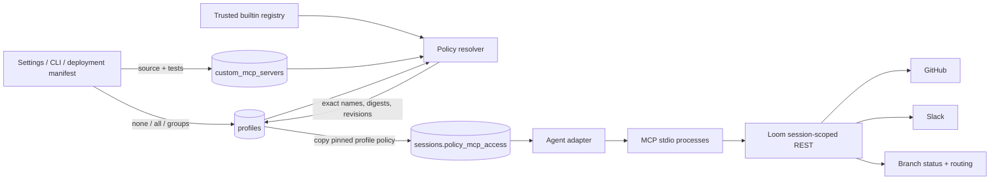
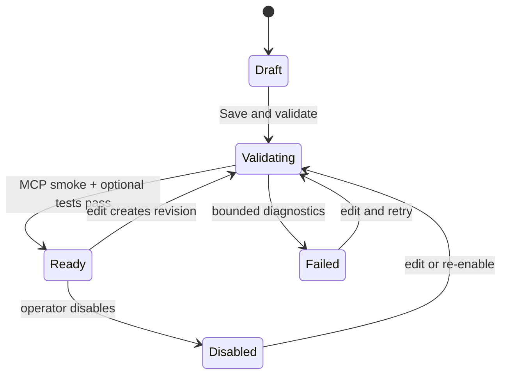
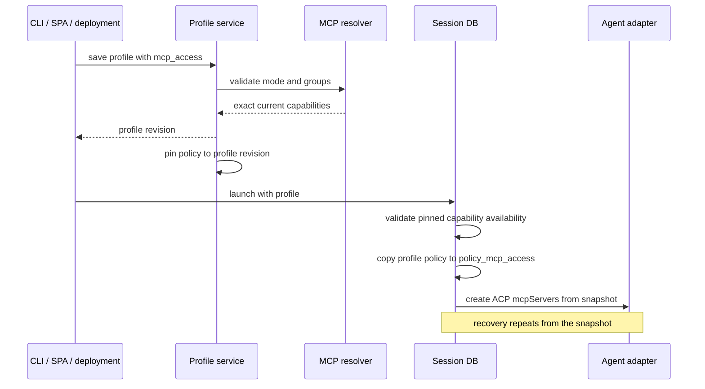

# MCP and profile control plane

Status: implemented design for Weaver issue #611

Related GitHub work: [#174](https://github.com/marin-community/loom/issues/174),
[#181](https://github.com/marin-community/loom/issues/181), and
[#183](https://github.com/marin-community/loom/issues/183), building on the
restricted-session foundation in
[#179](https://github.com/marin-community/loom/pull/179) and
[#191](https://github.com/marin-community/loom/pull/191).

> **Decision:** Profiles select provider-neutral MCP groups (`none`, `all`, or
> an explicit group list). Loom resolves that selection into an immutable,
> content-addressed session snapshot. Agent adapters translate the snapshot into
> provider-specific launch configuration only at the final runtime boundary.

## Why this model

The restricted GitHub work established the right security foundations:

- PR #179 moved executable MCP configuration into a trusted Rust registry and
  let the `github_comment` profile select a reviewed capability set.
- Sessions persist exact expanded permission names, so recovery does not
  re-expand a changed registry entry.
- PR #191 keeps GitHub credentials server-side and repository-scoped.
- Profile revisions already provide a stable launch contract for automation.

The old public model nevertheless combined two concepts in `allowed_tools`:

1. provider-native permission strings such as `Read(./**)`; and
2. Loom integration choices such as `mcp/github/comment`.

That made every profile look Claude-specific, gave other runtimes no clean
contract, and could not express “all messaging MCPs”, “only the GitHub group”,
or “no MCPs”. It also had nowhere safe to put operator-authored MCP programs.

## Architecture



The separation is deliberate:

- **Registry entries describe capability.** They have an identity, group,
  version or revision, content digest, description, exact tools, and a launch
  descriptor. A builtin digest covers the adapter/server identity, set
  metadata, ordered tool names, and full advertised tool schemas—not merely the
  friendly set name.
- **Profiles select and pin policy.** `mcp_access` is `{mode, groups}`. Saving
  resolves it into exact capability content on that profile revision; it
  contains neither commands nor provider permission syntax.
- **Sessions own history.** Launch stores the full resolved snapshot, including
  custom source, revision, digest, and exact capability sets. Recovery consumes
  this snapshot instead of today’s registry. Ordinary session views expose the
  exact identities, digests, revisions, and tools for audit while redacting
  custom source.
- **Adapters translate.** ACP receives its native `mcpServers` descriptors.
  Claude’s `allowedTools` remains only the final restricted-runtime permission
  translation, not the public profile vocabulary.

## Profile contract

```json
{
  "name": "ops",
  "agent_kind": "codex",
  "runtime_permissions": [],
  "mcp_access": {
    "mode": "groups",
    "groups": ["github", "messaging"]
  }
}
```

Modes:

- `none`: no MCP processes.
- `all`: every enabled builtin and custom MCP visible to ordinary sessions.
- `groups`: every enabled MCP whose group exactly matches a selected group.

Restricted profiles may select explicit trusted-builtin groups only; their
future-widening `all` mode is rejected. Custom definitions cannot use a builtin
group name, preventing a later operator definition from shadowing or widening a
restricted profile. Unknown groups fail profile writes and deployment
reconciliation; they never silently reduce or broaden access.

`runtime_permissions` is a backward-compatible escape hatch for restricted
filesystem rules. The API accepts legacy `allowed_tools` input as an alias, but
returns the provider-neutral name.

## Builtins and routing

| Identity / group | Purpose | Credential and routing boundary |
|---|---|---|
| `mcp/github/comment@v1` / `github` | Issue/PR view, comment, and edit | Existing repository-fixed REST bridge and server-side GitHub credential path from PRs #179/#191 |
| `mcp/messaging/status@v1` / `messaging` | Update the session’s Weaver status | Existing branch-status API; its durable event is mirrored to wired GitHub and Slack threads |
| `mcp/slack/message@v1` / `messaging` | Post in the session-bound Slack thread | Existing fixed-thread route; the workspace bot token stays in Loom |

> **Why status stays a CLI and gains an MCP facade:** `weaver status` is already
> the lifecycle contract used by prompts, humans, hooks, watches, the dashboard,
> and status cards. Replacing it would split state. The MCP tool is a structured
> convenience for runtimes that prefer tools; it calls the same API and creates
> the same event. Routing remains downstream of that event.

> **Why not expose generic Slack or GitHub SDKs:** Sessions already carry a
> repository or thread identity. Fixed, task-shaped operations keep credentials
> out of agent environments and prevent a profile from accidentally granting
> workspace-wide authority.

## Custom MCP definitions

Custom definitions use an absolute logical identity such as
`/engineering/search/docs`; the first path segment is the selectable group.
They live in SQLite because this is operator configuration rather than
repository content, and because source revisions must survive worktree archive.



Each immutable revision stores:

- identity, derived group, label, and description;
- Python source with optional PEP 723 inline dependencies;
- optional test source;
- revision and SHA-256 digest;
- discovered tool names, validation state, and bounded diagnostics;
- created and updated timestamps.

Save launches the script with `uv run --script`, performs real MCP
`initialize` and `tools/list` calls with a timeout, validates the advertised
tool names, and then runs optional authored tests with `LOOM_MCP_SOURCE`
pointing to the materialized server. Failed revisions remain editable and
inspectable but are excluded from profile snapshots.
Removing the last server in an explicitly selected custom group is rejected
until the referencing profiles are updated, so ordinary administration cannot
silently turn a valid group selection into an unknown one.

Editing a definition does not mutate existing profile revisions. A profile
continues to report and launch its pinned custom revision until the profile is
saved again; that explicit reconciliation advances the profile revision.
Disabling a pinned definition makes probe and new launch fail with a corrective
error instead of silently dropping the process. Existing sessions continue
from their own source snapshot.

The runtime materializes the exact session-stamped source into a private
temporary directory and launches it through `uv run --script`. The child starts
from a cleared environment and receives only `PATH`, Loom-controlled uv
cache/interpreter locations, plus the session-scoped Loom API context
(`WEAVER_API`, `WEAVER_BRANCH`, `LOOM_SESSION_ID`, and `LOOM_TOKEN`). A
deployment-level uv cache is reused when configured (including the standalone
container's persistent `/opt/uv` volume); otherwise validation gets a private
temporary cache. Cloud and provider credentials are not ambient custom-MCP
inputs.

The Loom wrapper also filters `tools/list` and rejects `tools/call` against the
profile-stamped tool names. That defense is required even though source is
snapshotted: a script can resolve dependencies or branch on runtime state, and
ACP runtimes without a provider-specific permission list must still receive the
same exact surface that validation approved.

Validation is an execution check, not an OS sandbox. Only administrators can
author custom MCPs, and restricted sessions reject them. Repository content can
neither define nor edit executable MCP configuration. Filesystem isolation from
[#180](https://github.com/marin-community/loom/issues/180) remains a separate
security boundary.

## Launch and recovery



This resolves #181’s audit and recovery problem without making versioning the
main user experience. Builtins use readable versions and content digests.
Custom revisions are immutable. Changing a builtin requires a new identity;
editing a custom MCP creates a new revision. An unchanged profile revision
therefore cannot silently widen when the registry changes. Saving that profile
is the explicit reconciliation point and advances its revision. Existing
sessions continue with their stamped policy and source.

## REST, CLI, and UI

REST:

- `GET /api/mcps` — merged builtin/custom registry.
- `GET/POST /api/mcps/custom` and
  `GET/PUT/DELETE /api/mcps/custom/{path}` — definition CRUD; writes validate.
- `GET /api/profiles/{name}/effective` — resolved policy preview.
- `POST /api/profiles/{name}/probe` — availability and disabled/failed checks.
- ordinary session responses include the source-redacted exact MCP snapshot
  stamped at launch.

CLI:

- `loom mcp ls|show`
- `loom mcp add /group/name --label ... --file server.py [--tests test.py]`
- `loom mcp rm /group/name`
- `loom profile show <name> --effective`
- `loom profile probe <name>`

The Settings page provides source and test editors, validation output, and
enable/disable state. The profile editor renders `none`/`all`/group selection
from the registry. Provider-specific runtime permissions remain a clearly
labelled legacy escape hatch rather than “Allowed Claude tools”.

## Conformance and security tests

The implementation incorporates the reusable portion of #183:

- every registered builtin advertises tools belonging to a declared set;
- permission translation and server selection are exact;
- builtin subprocesses receive and enforce the session-stamped tool subset, so
  later sets on a shared adapter cannot widen `tools/list`;
- every real builtin subprocess passes initialize, tools/list, notification,
  unknown method/tool, malformed input, and clean-EOF checks;
- the messaging status tool is exercised through a real subprocess, a
  session-scoped token, and the existing durable branch-status route;
- fresh launch and recovery use the same provider-neutral ACP descriptor shape;
- custom source is smoke-tested over real MCP stdio through `uv`;
- custom runtime discovery and calls are filtered to the profile-stamped tool
  names even if the underlying script advertises something new;
- custom definitions cannot shadow trusted groups or enter restricted sessions;
- existing restricted-session tests keep GitHub credentials server-side.

OS-level filesystem isolation from #180 and conditional mutation preconditions
from [#182](https://github.com/marin-community/loom/issues/182) remain separate
security projects. This design preserves those boundaries and does not claim to
implement them.

## Alternatives rejected

1. **Keep `allowed_tools` and add prefixes.** Cheap initially, but it leaks
   Claude policy into every client and cannot represent executable revision
   identity safely.
2. **Let profiles store arbitrary MCP command JSON.** That turns deployment or
   repository data into an execution-injection path and weakens PR #179’s
   reviewed restricted-session boundary.
3. **Install every MCP globally.** Every agent would inherit dependency,
   credential, and unnecessarily broad tool-surface coupling.
4. **Replace `weaver status` with a messaging MCP.** That would fork the durable
   status/event model and strand terminal agents and hooks.
5. **Store custom MCP files in repositories.** Untrusted checkout content would
   choose executable launch configuration, and revisions would disappear with
   archived worktrees.

## References

- [MCP base protocol and lifecycle](https://modelcontextprotocol.io/specification/2025-06-18/basic)
  defines the JSON-RPC initialization and notification contract used by
  validation and the real-process conformance harness.
- [MCP stdio transport](https://modelcontextprotocol.io/specification/2025-06-18/basic/transports)
  defines subprocess ownership and newline-delimited stdin/stdout framing.
- [MCP tools](https://modelcontextprotocol.io/specification/2025-06-18/server/tools)
  defines `tools/list`, `tools/call`, and the advertised schema surface that
  capability-set digests cover.
- [Agent Client Protocol](https://github.com/agentclientprotocol/agent-client-protocol)
  is the provider-neutral agent boundary; its session lifecycle carries native
  `mcpServers` on new and loaded sessions.
- [uv single-file scripts](https://docs.astral.sh/uv/guides/scripts/) documents
  PEP 723 inline dependencies, isolated environments, caching, and optional
  script lockfiles.
- Existing Loom work: issues
  [#174](https://github.com/marin-community/loom/issues/174),
  [#180](https://github.com/marin-community/loom/issues/180),
  [#181](https://github.com/marin-community/loom/issues/181),
  [#182](https://github.com/marin-community/loom/issues/182), and
  [#183](https://github.com/marin-community/loom/issues/183); restricted-session
  PRs [#179](https://github.com/marin-community/loom/pull/179) and
  [#191](https://github.com/marin-community/loom/pull/191).

## Result

Profiles are now a stable, provider-neutral integration contract. Builtins keep
credentials and routing inside Loom. Custom MCPs are editable and
dependency-self-contained without being confused for a sandbox. Session
snapshots make launches auditable and recovery deterministic. The model extends
the existing restricted-session work instead of weakening it.
