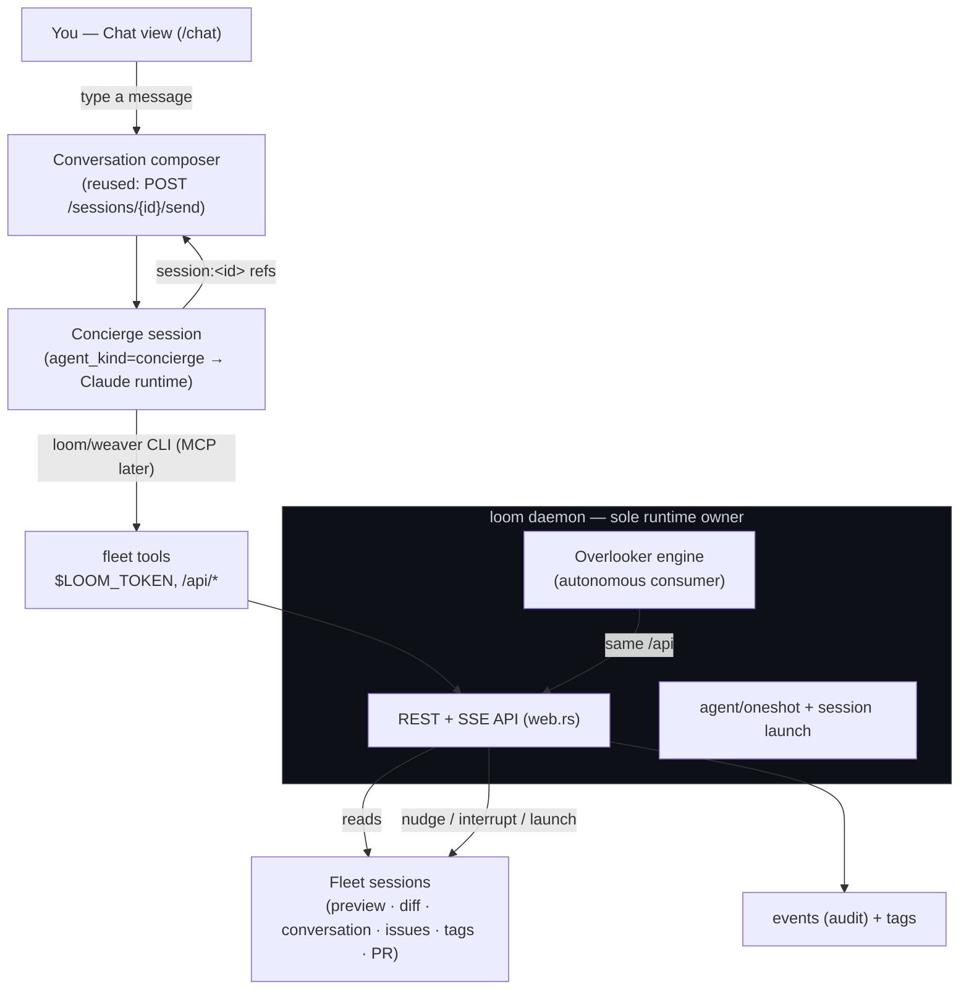

# The Concierge — a conversational meta-layer over the fleet

A weaver [plan](../structured-projects.md) (weaver issue #280): the design
surface for a **Chat** layer that lets you *talk to an agent about the other
sessions*. This file owns the *structure* — the problem, the architecture, the
tasks and their dependencies; the issue ledger owns the *state*. Nothing here
ships yet — it is the design of record to build against. The [Tasks](#tasks)
materialise into weaver issues when the design is agreed.

## Problem & goal

You launch a handful of sessions over a morning, wander off, and come back to a
wall of cards. You *can* read the fleet — every session's screen, diff,
conversation, PR, and tags are one REST call away — but the only thing that
turns that raw state into an answer is **you**, clicking through tabs. The
questions you actually have are in plain language:

- *"Are there any stale sessions I should know about?"*
- *"Which of these need me, and why?"*
- *"What did the auth-refactor session actually change?"*
- *"Spin up a session to fix the flaky e2e test, and tell me when it's done."*

[The overlooker](overlooker.md) answers the *push* half of this: it wakes on a
timer, surveys the fleet, and stamps a `triage` mark on what looks stuck. But an
overlooker can't be *asked*. It runs a fixed program on a schedule; it can't
hold a conversation, follow a hunch, or do the one-off investigation you only
thought of just now. The missing primitive is the **pull** half: an agent that
**holds the whole fleet in its head**, that you **converse with on demand**, and
that can **act on your behalf** — read a session and summarise it, point you
straight at the one that needs you, nudge a stuck one, or launch a new workstream
and watch it for you.

The goal: a **Chat** surface — a top-level view, sibling to the session list —
backed by a fleet-aware agent that is *auto-hooked into loom* the moment it
starts, so you can ask about the floor and have it answer, link, and act.

## The insight: the overlooker's conversational twin

The overlooker design already did the hard architectural thinking, and it lands
on the exact seam this feature needs:

> Everything loom can do is a REST route; an out-of-process agent reaches the
> fleet only through that API, with a **capability-gated** client over it and a
> **bounded, audited intervention ladder** (observe → mark → nudge → interrupt →
> launch). The daemon stays the single owner of the live runtime.

That is *already built*: `python/weaver-loom` is a capability-gated `Client` over
the REST API; `POST /api/agent/oneshot` is the env-stripped headless-agent
primitive; the overlooker engine is the autonomous consumer of it.

So the concierge is **not a new subsystem — it is a second front-end on the same
substrate.** Two ways to drive one fleet API:

| | **Watch** (overlooker) | **Chat** (concierge) |
|---|---|---|
| Trigger | a cron tick or a fleet event | a message you type |
| Cadence | autonomous, scheduled | on-demand, interactive |
| Output | a `triage` mark on a branch | a reply in a conversation |
| Memory | per-round lookaside state | a running conversation |
| Reaches the fleet via | the bound REST API | the **same** bound REST API |
| Acts via | the capability ladder | the **same** capability ladder |

They are siblings in the nav rail (the rail already pairs them: **Watch** is an
eye over the looms; **Chat** is the conversation about them) and they *converge*:
the most natural way to *create* an overlooker — "ping me whenever a session goes
red" — is to **ask the concierge to draft one for you** (the overlooker plan
already calls for agent-authored overlookers via the CLI). Chat is how you reach
into the fleet right now; Watch is how you ask it to keep an eye out for you.
The concierge is the front door to both.

## The name

The mill metaphor runs through weaver — `loom`, `weaver`, `tapestry`, and the
**overlooker** who walks the rows and tends the looms. The conversational
companion plays a different role: the one who *knows where everything is*, points
you to what needs you, and runs an errand on your behalf. That is a
**concierge**. It is the working noun in the code and the API (`agent_kind =
"concierge"`); the UI surface is plainly labelled **Chat** (what the user does
there). (Decided over the themed `gaffer` — the Lancashire mill foreman — for
legibility; `overlooker` already carries the dialect.)

- A **concierge** is the fleet-aware chat agent.
- A **chat** is one conversation with it.
- The **fleet tools** are the MCP surface it reaches the fleet through.

## TL;DR

1. **A concierge is a session, not a new runtime.** It is a normal loom session
   of a new `agent_kind = "concierge"` — its own worktree, terminal supervisor,
   and lifecycle — so it reuses the **entire** session machinery: launch, the
   live terminal, orphan/adopt across a restart, and — the big win — the
   **already-drivable [Conversation tab](../ARCHITECTURE.md)**, whose composer
   sends a prompt straight into the agent and auto-refreshes on its turn edges.
   Chatting with the fleet is *turn-taking with an agent*, which loom already
   does.
2. **It reaches the fleet through the tools it already has — the `loom`/`weaver`
   CLI — and, later, a typed MCP.** A concierge session has `loom` and `weaver`
   on `PATH` with `$WEAVER_API` + `$LOOM_TOKEN` injected, so `loom session
   ls/preview/poll/send/launch` and `weaver issue ls` give it the *whole* fleet —
   read and act — on day one, no new server. A `loom mcp` stdio server that turns
   those same routes into typed tools is the **follow-up** ergonomics layer (no
   Rust MCP crate is vendored today, so it is real work, not a free reuse); it is
   not on the critical path for a working concierge.
3. **Auto-hooked at launch.** Launching a concierge installs its `mcpServers`
   block into `.claude/settings.local.json` (the same merge `install_hooks`
   already does for the status hooks), injects `$LOOM_TOKEN`, grants its
   capability set, and seeds a **`CONCIERGE.md` primer** — the analogue of
   `WEAVER.md` — full of *tips*: how to glance at a session fast (`preview`),
   read it deep (`conversation`), judge staleness (`last_activity_at` + the
   `idle`/`attention` tags), and link to it. It boots already knowing the fleet.
4. **It produces links you can click.** The concierge answers with live
   **`session:<id>` references** that the conversation renderer projects into
   status chips linking to `/s/<id>` — the smartdoc `#41`-issue-chip machinery,
   pointed at sessions. "Look into `session:ab12`" becomes a click.
5. **It acts on your behalf, on the bounded ladder, with you in the loop.**
   `observe`/`link` are always on; `nudge`, `interrupt`, and `launch` are
   capability-gated and — because a human is *right there in the chat* — confirmed
   conversationally before they fire. Every action is an `events` row, exactly
   like an overlooker's.
6. **It never authors another actor's facts.** The agent owns its `attention`
   tag; the overlooker owns `triage`. The concierge **talks** — its findings live
   in the conversation, not as a third writer fighting over the same tag.

The rest argues each point.

## Architecture

The concierge is just another out-of-process consumer of the REST API — like the
overlooker binding and the `loom` CLI — wrapped this time as MCP tools and driven
by a conversation instead of a cron tick.

## The fleet tool surface: the CLI now, a typed MCP later

The user asked for "MCP or readmes for an agent to understand how to explore
loom." The honest answer after checking the code: **the CLI is already the whole
surface**, and an MCP is a later ergonomics upgrade.

- **The CLI is the v1 surface.** A concierge session has `loom` and `weaver` on
  `PATH` with `$WEAVER_API` + `$LOOM_TOKEN` injected, so it can already read and
  act on the entire fleet: `loom session ls` (the fleet), `loom session preview
  <id>` (a screen glance), `loom session poll/wait/send/break <id>` (observe and
  drive), `loom session launch "<task>"` (spawn work), and `weaver issue ls/show`
  (the boards). "The CLI *is* the API mirror," as the overlooker plan puts it — so
  a working concierge needs *no new tool surface at all*.
- **The primer is the tips.** `CONCIERGE.md` (below) is the "readme" — not an API
  reference but *judgement*: which command to reach for, and how to read what it
  returns.
- **The MCP is the follow-up.** Typed, structured tool results suit an agent
  better than scraped CLI text, so a `loom mcp` stdio server that wraps the same
  routes is worth building — but it is net-new (no Rust MCP crate is vendored) and
  strictly an upgrade, so it lands *after* the CLI-based concierge ships. When it
  does, it gates on the capability set the same way `weaver_loom._gate` does.

The fleet a concierge reads/acts on maps onto routes/commands that already exist —
note there is **no** `/sessions/{id}/diff` route today (a thing the overstated
ARCHITECTURE table implies); "what did it change" comes from the conversation or
`git` in the worktree, not a diff endpoint:

| What the concierge does | CLI today | REST | Later MCP tool |
|---|---|---|---|
| list the fleet (filter attention/idle/repo) | `loom session ls` | `GET /api/sessions` | `fleet_list` |
| one session | `loom session poll <id>` | `GET /api/sessions/{id}` | `session_get` |
| fast screen glance | `loom session preview <id>` | `GET …/preview?lines=N` | `session_preview` |
| deep read / summarise | (read its log) | `GET …/conversation` | `session_conversation` |
| the boards | `weaver issue ls` | `GET /api/issues` | `fleet_issues` |
| nudge a session | `loom session send <id> …` | `POST …/send` | `session_nudge` |
| interrupt a turn | `loom session break <id>` | `POST …/interrupt` | `session_interrupt` |
| launch a workstream | `loom session launch …` | `POST /api/sessions` | `session_launch` |
| link to a session | write `/s/<id>` | — | `session_link` |

## The concierge as a session kind

`agent_kind` *selects the agent command* — only `"claude"` gets the Claude hooks
and launch-gates; any other value is run as an executable name. The concierge is a
new kind, but `agent_kind = "concierge"` is a **role marker**, not a runtime: it is
what hides the session from the fleet, finds the singleton, and selects the primer.
The runtime it *actually* launches is resolved separately from the
**`concierge.runtime`** setting (claude default, codex opt-in — see below), so the
role and the binary stay decoupled. With the default, the concierge runs the same
`claude` command and takes the same `install_hooks` + `seed_claude_launch_gates`
path as a normal claude session. Two deltas at launch, both small:

1. **Seed the primer.** The concierge's opening prompt is the `CONCIERGE.md`
   primer (the launch path already writes a `goal.txt` opening prompt; for a
   concierge that text *is* the primer). Because the primer lands in the branch
   goal, `weaver summary` replays it after a compaction — durable orientation
   with zero new primer machinery. The normal `WEAVER.md` session primer still
   injects, so the concierge also knows the weaver-session basics it lives in.
2. **No withheld capabilities.** With launch-by-default at single-operator scale,
   the concierge holds the full ladder; the permission gate is the conversation,
   so there is **no per-session capability column** to add for v1. (A later
   unattended/multi-user mode adds one — the overlooker's binding already gates
   in-process, so the pattern exists when needed.)

Lifecycle reuse is the point: the concierge rides launch, the live terminal,
orphan/adopt, and the already-drivable Conversation tab unchanged. It is
**identified and hidden from the fleet by its `agent_kind`** — *not* by the
overlooker's `managed_by` field, which carries adoption/archival semantics the
concierge must not inherit. A one-line filter drops `agent_kind = "concierge"`
from the session list; the **Chat** view finds the singleton by the same kind.

**Singleton to start.** One persistent concierge ("the fleet chat") that the
**Chat** view opens, auto-created on first use. Matches the single-operator auth
scale and the user's "a new Chat tab which gives us an agent." Multiple named
chats (one per investigation) are a clean later extension — a chat is a session,
and loom already lists many.

### Runtime: claude (default) or codex

The **`concierge.runtime`** setting (Agents group; enum `claude` | `codex`,
default `claude`) chooses the agent that backs the concierge — the one place the
role-vs-runtime split surfaces to the operator. `claude` is the full-fidelity
path: the Claude Code TUI with weaver's lifecycle hooks, so the Chat view shows
live working/idle status and auto-refreshes on each reply. `codex` runs Codex with
the same primer-as-opening-prompt — its conversation renders in the Chat view
(transcript support already exists), but **Codex does not fire weaver's hooks**, so
the concierge gets no live status and the view won't auto-refresh per reply (use
Refresh). A codex-backed session therefore launches `running` (it is live
immediately) rather than `launching` (which waits for a hook that never comes), and
its launch skips `install_hooks` / `seed_claude_launch_gates` (Codex reads
neither). Wiring Codex into the weaver status hooks is the obvious Phase-1 upgrade.

### The primer (`CONCIERGE.md`) — the tips

The judgement an agent needs that the commands don't encode. Sketch:

- **Glance vs. deep-read.** `loom session preview <id>` (the live screen, cheap)
  is for a fast read of *what a session is doing right now*; the conversation log
  is for *what it has done and decided* — use it to summarise. `branch.github`
  (in `loom session poll`) for PR/CI state.
- **Reading staleness.** A session is likely stale when it is `running` but
  carries the quiet `idle` tag and its `last_activity_at` is old, with no loud
  `attention`. "Needs me" is the loud `attention`/`triage` ladder. Don't confuse
  the two: idle is calm, attention is a call.
- **Always link.** Refer to a session as a `/s/<id>` markdown link so the user
  can click through; name the repo and branch so the reference is legible.
- **Be a concierge, not a cowboy.** Summarise and point first. Before you nudge,
  interrupt, or launch, say what you'll do and why, and let the user confirm in
  the next turn. You have the whole fleet in view — the user has one question;
  bridge the two.

## The Chat surface (UI)

API-first ([[ui-built-on-rest-api]]), and mostly *assembly of parts that exist*:

- **A top-level rail entry, `Chat`** — sibling of Sessions / Issues / **Watch** /
  Shell (a `messages-square` glyph). Routes to `/chat`.
- **The view reuses `SessionConversation.vue`** — the skimmable iris-log renderer
  with the foot composer. The composer already POSTs to `/sessions/{id}/send`
  (type + Enter) and auto-refreshes on the agent's turn edges, so the chat
  round-trip is *already solved*; `/chat` get-or-creates the singleton concierge
  and mounts the component against it.
- **Session links.** v1: the concierge writes plain `/s/<id>` markdown links,
  which navigate to the session. The *polished* form — projecting a `session:<id>`
  reference into a live status chip (title + attention dot), the way smartdoc
  renders a `#41` issue chip — is a follow-up: it needs a real ref-projection map
  plus dompurify/click handling in `MarkdownView`, not just a regex, so it does
  not gate the first cut.

## Producing links & acting on your behalf

Two tiers of action, both reusing existing primitives:

- **Nudge / interrupt an existing session.** `loom session send <id> …` (→
  `POST /sessions/{id}/send`) types a message into a watched session's agent;
  `loom session break <id>` (→ `POST …/interrupt`) stops its turn. "Tell the auth
  session to rebase on main" becomes one command. (Audit parity is a follow-up:
  `send` already records a `nudge` event with `by`, but `interrupt` records none
  and a launch isn't attributed to the concierge — closing that gap is a small
  API change, [C6](#tasks).)
- **Launch a new workstream.** `loom session launch "<task>"` (→
  `POST /api/sessions`) forks a fresh session for work the user wants done, and
  returns its **tracking issue**. The concierge can then watch it (`weaver issue
  wait` / `loom session poll`) and report back in a later turn — "the flaky-test
  fix is /s/cd34; it opened a PR, CI is green."

The concierge **does not write the `triage` tag** — that is the overlooker's
fact, and two actors authoring one fact is the anti-pattern the overlooker plan
is built to avoid. Its findings live in the conversation. If a durable mark is
ever wanted, it writes its *own* typed key (loudness lives in the value, not the
key), never `attention` or `triage`.

## Capabilities & safety

The concierge inherits the overlooker's safety frame wholesale — it is the same
ladder over the same API:

- **The intervention ladder, enforced at the MCP boundary.** `observe`/`link`
  always on; `nudge`/`interrupt`/`launch` gated. A tool call past the granted set
  is refused before it hits the API.
- **Human-in-the-loop by construction.** Unlike an autonomous overlooker, every
  concierge action is bracketed by a user turn — it proposes, you confirm. That
  is what makes a more permissive default capability set safe.
- **No recursion.** A concierge's `fleet_list` excludes concierge and overlooker
  sessions; it cannot act on a watcher. Watchers don't watch watchers, and the
  concierge doesn't drive itself.
- **Everything is an event.** Every nudge, interrupt, and launch is an `events`
  row with the concierge as author — the same audit trail the overlooker round
  history renders, visible on the touched session's activity.
- **Kill switches.** Archiving the concierge session tears it down like any
  other; a `concierge.enabled` (or reuse `overlooker.enabled`-style) setting gates
  the feature.

## Worked example: "any stale sessions I should know about?"

End to end, on the singleton concierge:

1. You open **Chat** and type the question. The composer sends it into the
   concierge session (reused `/send`); the Conversation tab streams the reply.
2. The concierge runs `loom session ls` and filters to `running` sessions
   carrying the quiet `idle` tag with an old `last_activity_at` and no loud
   `attention` — its staleness heuristic from the primer.
3. For each candidate it runs `loom session preview <id>` (and reads the
   conversation when it needs to know *why* it stalled — waiting on a prompt?
   wedged on a failing test?).
4. It replies in plain language with clickable links:
   > Two look stale. /s/ab12 (weaver / *auth-refactor*) finished its turn 3 h ago
   > waiting for review — its PR is green. /s/cd34 (loom / *flaky-e2e*) has been
   > re-running the same test for 40 min with no progress. Want me to nudge cd34
   > to try a different approach, or leave it?
5. You reply "nudge it." The concierge runs `loom session send cd34 "…"` (recorded
   as a `nudge` event) and confirms.

No new survey engine, no new agent runtime, no new status axis, and — for the
first cut — no new tool surface: a conversation over the CLI the fleet already
exposes.

## Peer review (codex)

A codex pass over the codebase corrected three overstated seams, now folded in
above: `agent_kind` selects the *command* (so the concierge maps to the Claude
runtime, not a free-standing kind); the hidden/warm lifecycle is overlooker-
specific (`managed_by`), so the concierge is hidden by its **kind** instead; and
there is no `/sessions/{id}/diff` route. It also flagged that the capability
column, the MCP server, the `session:<id>` chip, and interrupt/launch audit
attribution are all net-new — which is why the plan below ships the concierge on
the **existing CLI** first and defers those. Verdict: *ship with fixes*.

## Tasks

Each task has a stable id; `deps:` edges define the delivery sequence. The Phase-0
set (C1–C3) is deliberately the *tight* cut — a working, fleet-acting concierge
with **no new runtime, server, or schema**, just a kind that maps to Claude, a
primer, and a view.

### C1 — `concierge` kind mapped to the Claude runtime  `value: high`  `deps: —`
In `agent.rs`, `agent_kind = "concierge"` runs the `claude` command and takes the
`install_hooks` + `seed_claude_launch_gates` path (today gated on `=="claude"`).
No schema change; no capability column (full ladder, prompt-level confirmation).
Acceptance: launching a concierge boots a real Claude agent with weaver hooks.

### C2 — `CONCIERGE.md` primer + primer-as-opening-prompt  `value: high`  `deps: —`
The tips doc (`include_str!`'d into loom): glance vs. deep-read via `loom session
preview`, the staleness heuristic, always-link with `/s/<id>`, propose-then-act,
and the `loom`/`weaver` commands it drives the fleet with. The concierge launch
path uses it as the opening prompt. Acceptance: a fresh concierge knows how to
survey and act on the fleet without being told.

### C3 — The Chat view + get-or-create + hide-by-kind  `value: high`  `deps: C1, C2`
A `/chat` rail entry + route; a `GET /api/chat` handler that get-or-creates the
singleton concierge (in the most-recent repo) and returns its `SessionView`; the
view mounts `SessionConversation.vue` against it; `SessionList` filters out
`agent_kind == "concierge"`. Acceptance: Chat opens a working conversation with
the fleet agent; the concierge does not appear in the fleet list.

### C4 — `loom mcp`: a typed fleet tool server  `value: med`  `deps: C1`
A stdio MCP server (new `loom mcp` subcommand, a new MCP dep) wrapping the read +
act routes as typed tools, installed into the concierge's
`.claude/settings.local.json` (extend `install_hooks` to also merge `mcpServers`,
preserving any existing entry). Strictly an ergonomics upgrade over the CLI.
Acceptance: the concierge lists and reads the fleet through typed tools.

### C5 — `session:<id>` linkified chips  `value: med`  `deps: C3`
Project `session:<id>` into a live status chip linking to `/s/<id>` in the
conversation `MarkdownView` — a real ref-projection map plus dompurify/click
handling, not a regex. Acceptance: a concierge reply's session references render
as clickable status chips.

### C6 — Action audit parity  `value: med`  `deps: C1`
Record an `events` row (attributed to the actor) for `interrupt`, and attribute a
concierge-driven `launch`, so every action the concierge takes is auditable like a
`nudge` is today. Acceptance: interrupt and launch show in the touched session's
activity with an author.

### C7 — Overlooker authoring from chat  `value: low`  `deps: C4, overlooker T8`
The concierge drafts/dry-runs/registers an overlooker so "ping me whenever a PR
goes red" becomes a real watch. The Chat ⇄ Watch convergence. Acceptance: the
concierge scaffolds and dry-runs an overlooker from a chat turn.

## Rollout

- **Phase 0 — A working concierge (the tight cut).** C1 (kind → Claude), C2
  (primer), C3 (Chat view + get-or-create). First milestone: you open Chat, ask
  "any stale sessions?", and get a linked, summarised answer — and it can nudge or
  launch on your say-so, all over the existing CLI. No new server, schema, or dep.
- **Phase 1 — Ergonomics & polish.** C4 (typed MCP), C5 (session chips), C6 (audit
  parity). Sharper tools and clickable chips over the same working concierge.
- **Phase 2 — Convergence.** C7 (author overlookers from chat). Chat becomes the
  front door to Watch.

## Non-goals

- **Not a new agent runtime.** A concierge is a session; it reuses launch, the
  terminal, orphan/adopt, and the drivable Conversation tab. We add a tool server
  and a primer, not a parallel agent loop.
- **Not a new status axis.** The concierge talks; it never writes `attention` or
  `triage`. Two actors never author one fact.
- **Not a second fleet API.** The MCP wraps the existing REST routes — one seam,
  one more consumer beside the overlooker binding and the `loom` CLI.
- **Not autonomous.** The concierge acts only inside a conversation, each action
  confirmed by a user turn. The autonomous watcher is the overlooker; this is its
  on-demand twin.
- **Not multi-tenant yet.** One singleton concierge at the single-operator scale;
  many named chats is a later, additive step.

## Decisions

- **Name** — `concierge` in the code/API, **Chat** in the UI. The themed `gaffer`
  is dropped for legibility.
- **Default capabilities** — the full ladder (`observe`, `link`, `nudge`,
  `interrupt`, `launch`), because the operator drives it turn by turn; the
  conversation is the permission gate. A later unattended/multi-user mode can dial
  it back per concierge.
- **Role vs. runtime** — `agent_kind = "concierge"` is the *role* (hidden, singleton,
  primed); the *runtime* is the `concierge.runtime` setting (claude default, codex
  opt-in). Keeping them separate means a runtime swap moves nothing else, and codex
  rides the existing transcript support. The known cost — no live status for codex
  until its hooks are wired — is documented in the setting and on the Chat view.

## Open questions

- **Worktree-backed vs. lightweight chat.** A concierge-as-session gets a worktree
  it mostly doesn't use. The alternative — a bespoke `chats` table driven by a
  multi-turn variant of `agent/oneshot`, no worktree — is *lighter* but
  *reinvents* the conversation viewer, the composer, the terminal, and
  orphan/adopt. Recommend session-backed (maximal reuse, ships fastest); revisit if
  the empty worktree grates.
- **Staleness as a server signal.** The concierge computes staleness client-side
  from `last_activity_at` + tags. The overlooker plan (T7) also wants a synthetic
  `session.stale` event — if that lands, both consumers should share one
  definition rather than each rolling their own.
- **Singleton scope.** One concierge per machine, per operator, or per repo? Start
  global (single-operator scale); scope later if it earns its keep.
