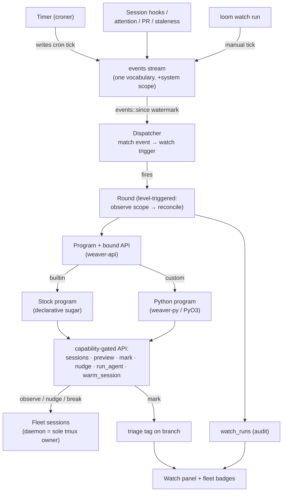

# The Watch — periodic, triggered watch agents

A weaver [plan](../structured-projects.md) (issue
[#61](https://github.com/marin-community/loom/issues/61)): the design surface and the
task breakdown for one large effort. This file owns the *structure* — the
problem, the architecture, the tasks and their dependencies; the issue ledger
owns the *state* (which task is open / in-flight / done). Nothing here ships
yet — it is the design of record to build against. The [Tasks](#tasks) section
materialises into weaver issues on `weaver plan sync watch`.

## Problem & goal

You launch a handful of sessions over a morning, wander off, and come back to a
dashboard of unknowns. Which of these are quietly stuck retrying the same test?
Which finished an hour ago and are sitting idle waiting for a nudge nobody gave?
Which raised `attention` while you were in a meeting? Today the only answer is
*you*, scanning the fleet by hand.

weaver already has the parts for one session to watch another:
`weaver issue wait`, `loom session {poll,wait,send,break,preview}`. A **parent
session** can monitor its children — block on them, read their screens, nudge
them. But that only works if you *set it up in advance*: you have to launch the
parent first and hand it the children. The common reality is the opposite:

- You didn't create an overseer up front, and now you have five **unrelated**
  sessions — different repos, launched at different times, no common parent —
  that would all benefit from the same periodic once-over.
- The judgement you want is *recurring and cross-cutting* ("every hour, look at
  everything that isn't idle and tell me what needs me"), not a one-shot
  parent→child relationship wired at launch.

So the missing primitive is a **retroactive, scheduled, fleet-wide watcher**: a
thing that wakes on a trigger — a clock tick, or a session event — surveys
whatever sessions exist *right now*, applies judgement, and acts: marks a
session as fine, tags one that looks stuck, nudges a third, escalates a fourth to you.
It is not tied to any one workstream. It is infrastructure that watches
the workstreams.

## What the field does (and what to steal)

Five reference points, each contributing one idea.

| Pattern | What it is | The idea to steal | Where it hurts |
|---|---|---|---|
| **Supervisor agent** (LangGraph, Databricks, Strands) | a central LLM coordinator that routes tasks to specialist sub-agents, monitors, retries, synthesises | a single agent that *holds the fleet in its head* and exercises judgement over it | the supervisor is a single point of failure and a cost/latency bottleneck; if its plan hallucinates, everything downstream is wasted |
| **Scheduled / heartbeat agents** (cron-triggered, "paperclip" heartbeat) | an agent woken on an interval; each wake it gets a *context package* (recent activity, outstanding tasks, new inputs) and runs a checklist | wake → compose a fresh snapshot → reason → act → sleep; the snapshot, not the agent's stale memory, is the source of truth for the round | a dumb cron "runs a job"; the value is only there if the woken thing *reasons* — and unbounded reasoning on a timer burns money |
| **Kubernetes reconciler** (controller pattern) | a loop that observes current state, diffs against desired, acts to close the gap — **level-triggered**, not edge-triggered | treat an event as a *nudge to re-survey the whole world*, not as a thing to react to once; idempotent, self-healing, no missed-event replay | desired-state reconciliation assumes a declarative target; "is this agent stuck?" has no clean `spec` to diff against — the judgement is fuzzy |
| **Rules engine** (trigger → condition → action) | declarative automations: an event fires, a condition filters, an action runs; priorities, stop-conditions | the clean **trigger / scope / action** decomposition, and that *most* checks are cheap mechanical rules that need no LLM at all | pure rules can't make the judgement call ("does this screen *look* stuck?") that motivated the whole thing |
| **Stuck-agent watchers** (Wink, ClawKeeper, HITL guardrails) | a watcher monitors an agent's tool-use / loops and intervenes — nudge, interrupt, or escalate to a human past a threshold | the **intervention ladder** (observe → nudge → interrupt → escalate) and that autonomy must be *bounded* and *auditable* | a watcher that acts too eagerly is worse than none — it interrupts healthy work and erodes trust |

The synthesis writes itself: a **level-triggered reconciler** (K8s) whose
"reconcile" step is a **bounded supervisor agent** (LangGraph) woken by an
**event** with a **fresh context package** (heartbeat), most of whose decisions
are cheap **rules** (rules engine) and whose actions climb a **bounded, audited
intervention ladder** (stuck-agent watchers).

## The name

A **watch** is a standing lookout over the weaving shed: it walks the rows
while the weavers work, keeps the looms running, spots the one throwing a
fault, and fixes or flags it. Not a weaver — a *watcher of* weavers and their
looms, and loom is already our session orchestrator. So:

- A **watch** is one configured watch program.
- A **round** is one execution of it (it "walks the shed" / "does its rounds").
- A **mark** is the assessment it stamps on a session — the new status indicator
  the problem statement asks for.

"Overseer" stays as the plain-language synonym in prose; **Watch** is the
noun in the code and the UI.

## TL;DR

1. **One subsystem, three nouns.** A **watch** (a watch definition), a
   **trigger** (an event match), and a **round** (one execution), in a dedicated
   **Watch panel** — infrastructure, separate from the session fleet.
2. **One event vocabulary; cron is an event.** There is no `cron` vs `event`
   fork. The timer emits a `cron` tick into the *same* `events` stream session
   changes already flow through; the engine is a pure **event consumer** that
   matches new events to watch triggers. A clock tick and an
   `attention=blocked` event are handled by one code path — **level-triggered**,
   so either is just a nudge to re-survey the whole scope. A watch may be
   **repo-scoped** — an optional `repo` on its trigger filters the stream to one
   repository, so a watcher can tend just one project's sessions.
3. **One runtime owner, one API seam.** The live tmux/worktree/session runtime
   stays **single-owner in the loom daemon** (two processes driving tmux = races
   and broken orphan-detection). Everything else reuses it through one new shared
   crate, **`weaver-api`** — the typed client + DTOs lifted out of loom — used by
   the engine, the `loom` CLI, and the Python binding alike. Not a second
   runtime: one seam over the existing one.
4. **A separate tag for the mark.** Lifecycle (`session.status`) and the agent's
   own `attention` tag stay untouched. The watch writes a *separate*
   `triage` tag — *its* assessment — so it never stomps what the agent said about
   itself. Both are well-known keys in the branch's `tags` table.
5. **One execution substrate: a program with the bound API.** Python (via PyO3)
   is the first-class authoring language; the no-code **declarative** watch
   is sugar over a built-in stock program. "Warm vs fresh" is not an engine
   mode — it is a library call the program makes (`warm_session()` to keep a
   session across rounds, `run_agent()` for a one-shot, or neither for pure
   rules).
6. **Agent-authorable and bounded.** The same `weaver-api` vocabulary is exposed
   over the CLI with a `--dry-run` simulator, so you can ask an agent to draft,
   dry-run against the live fleet, and iterate a new watch. Least-privilege
   capabilities, per-round budget, cooldown, no-recursion, every action an event.

The rest argues each point.

## One event vocabulary: cron is an event

The cleanest version of the trigger model is the one with no special cases.
weaver already has a single event spine — the append-only `events` table that
`weaver hook` writes and the monitor consumes on a watermark. The watch
engine joins it as **another consumer**, and the trigger model collapses to:

> A **trigger** is a **subscription manifest** — a set of named events (plus an
> optional schedule) the *script declares*. The engine consumes new events and,
> for each, fires every watch subscribed to it. **Cron is not a separate
> mechanism — it is an event source.**

The manifest (stored in `trigger_spec`) carries `cron`/`every` (a schedule) and
`on: [...]` (the normalized trigger events to subscribe to, each `name` or
`name=level`), plus an optional `repo` filter. The script owns it: a watch runs
in **register mode** (`WEAVER_WATCH_MODE=register`) and prints its
manifest, which the engine reconciles onto the row whenever the watch is created
or its program changes. So the script — not whoever wired it up — decides which
events wake it (`Round.main(main, TRIGGERS)` in `weaver_loom`).

Concretely the engine has two halves:

- **The timer (a producer).** It keeps each scheduled watch's next-fire time
  (parsed with the [`croner`](https://github.com/Hexagon/croner-rust) crate) and,
  at fire time, writes a `cron` event into the stream — nothing more. A cron tick
  is a first-class, logged, SSE-broadcast event (`{kind: "cron", watch}`)
  you can see in the history, exactly like a hook.
- **The dispatcher (a consumer).** It reads `events::since(watermark)` like the
  monitor (its own independent watermark). For each new raw event it **normalizes**
  it into the watch-facing trigger vocabulary (`trigger_event_of`): a `tag` write
  of the `attention` key → `session.attention`, a `status` transition →
  `session.started`/`session.exited`, a `pr_merged` → `pr.merged`, and so on —
  one place maps the internal stream to the stable names scripts subscribe to.
  It then fires every watch whose manifest names that event. `loom
  watch run` injects a `manual` event. One dispatch path, whatever woke it.
  A trigger may also carry a **`repo`** filter; when set, the dispatcher only
  fires for events whose branch lives in that repo, so a watch can be
  pinned to a single project.

The normalized vocabulary: **schedule** (`cron`); **session lifecycle**
(`session.started`, `session.idle` — a finished turn —, `session.exited`,
`session.attention`, `session.stale`); **triage** (`triage.changed`); and **PR**
edges (`pr.opened`, `pr.checks_red`, `pr.checks_green`, `pr.merged`,
`pr.review_changed`). The PR edges are emitted once per real transition by the
GitHub poller's snapshot diff, so a watch wakes on the change, not on a poll.

This is why **level-triggered** (the K8s lesson) matters and is now structural:
the matched event is only a *nudge to look*. The round reconciles the *current*
scoped fleet — it never "handles" the specific event, so firing twice is
idempotent and a restart that misses events self-heals on the next tick. But the
round is also handed the **triggering session** (the branch the event named) as
its `trigger` context, so a reactive program can survey just that one session
(`rnd.triggered_sessions()`) instead of the whole fleet — the difference between
one GitHub call and one per session every tick. A `cron`/`manual` tick names no
session, so `triggered_sessions()` falls back to the full survey. The one
accommodation the events table needs: a **system scope** for fleet-global rows
(a reserved branch id) so a `cron` tick — which belongs to no branch — lives in
the same stream.

### The mark: a separate tag

The problem statement asks the watch to "mark them ok, or tag a new status
indicator." That indicator must be a **distinct signal**, not a write to the
existing two:

- `session.status` is the **lifecycle** — mechanical, orchestrator-owned.
- The branch's **`attention` tag** is what the **agent says about itself** —
  "I'm blocked", "ready for review". The watch must never overwrite this;
  conflating "the agent declared blocked" with "the watch thinks it's
  stuck" destroys the signal that made watching worthwhile.
- The branch's **`triage` tag** is **the watch's assessment**: value
  `attention` | `blocked` (absent ⇒ calm — there is no stored `ok`), plus a
  one-line `note`, `set_by` (which watch), and `set_at` (when). It is just
  another well-known key in the `tags` table, raised by a `tag` event the monitor
  re-broadcasts — so it costs no new machinery.

The dashboard resolves the louder of the two loud tags into one attention signal
with attribution, and renders any other tag as a quiet deletable pill. A tag is
shown **stale** when the session moves on (its `last_activity_at` advances past
the tag's `set_at`) until the next round refreshes it — so a "looks stuck" mark
from an hour ago doesn't lie about a session that has since recovered. Same
discipline as [structured projects](../structured-projects.md): **two actors must
never author the same fact.** The agent owns the `attention` tag; the watch
owns the `triage` tag.

## Library breakdown: one API seam, a single runtime owner

"Do we move some of the loom tmux/session management into a shared library?" The
answer turns on a hard invariant: **the live runtime has exactly one owner.** The
tmux sessions, the worktrees, the monitor's liveness/orphan detection — all
assume a single process driving them. Two processes both running
`tmux new-session` / `kill-session` and both reaping orphans would race and
corrupt state. So the tmux/session *runtime* must **not** be extracted to be
co-driven; it stays in the daemon.

What gets reused is therefore not the runtime but the **API over it**. There are
two kinds of consumer, and the seam serves both:

- **In-process** — the watch **engine** runs inside the loom server and
  already has direct access to `agent::launch`, `tmux`, `session`. No extraction
  needed; it is a loom module.
- **Out-of-process** — the **Python binding**, scripted watches, the CLI, and
  any agent helping author one. These run as separate processes and drive
  sessions **through the loom REST API**, never tmux directly.

So the one structural change is to lift loom's private client and its DTOs into a
shared crate:

| Crate | Role | Today | Change |
|---|---|---|---|
| `weaver-core` | pure shared logic (branch, issue, **events**, db, config, plan) | shared by both binaries | add the `tags` table + registry (the `triage` key) + the system-scoped `cron` event kind here |
| **`weaver-api`** *(new)* | the typed loom REST **client + request/response DTOs** | `client.rs` is private to loom; DTOs live inline in `web.rs` and are hand-mirrored in `frontend/types.ts` | extract both here, so the server, the CLI, and the binding share **one** typed surface (and the TS mirror tracks one source) |
| `loom` | the daemon: tmux/session **runtime**, web, monitor, **the watch engine** | the orchestrator | depend on `weaver-api` for DTOs; the engine is a new module |
| **`weaver-py`** *(new, maturin)* | the PyO3 `weaver` Python module | — | a thin Pythonic wrapper over `weaver-api` |

`weaver-api` is the load-bearing extraction: it is what makes "reuse the session
logic" true for everything outside the daemon **without** a second tmux owner,
and it removes the `web.rs` ↔ `types.ts` drift on the Rust side as a bonus. The
`weaver` agent CLI stays DB-direct for the daemon-less writes it already does
(`status`, which writes the `attention` tag, and the general `weaver tag`
group), exactly as the `attention` tag works.

## Execution: one program, one API

Rather than bake "warm session" vs "headless one-shot" vs "script" in as engine
modes, there is **one substrate: a round runs a program against the bound API.**
The program decides everything — whether to call an LLM, whether to keep a warm
session or spawn a fresh one, whether to act or just observe. The
warm/fresh/rules distinctions become *library calls inside the program*:

- `ov.sessions(scope)` / `s.preview()` / `s.diff()` — observe (always allowed).
- `s.mark(level, note)` — write the `triage` tag.
- `s.nudge(text)` / `s.interrupt()` — the intervention ladder (capability-gated).
- `ov.run_agent(prompt)` — spawn a **fresh** one-shot agent for a judgement call
  (the env-stripped `claude -p` pattern from
  [`scripts/lint-review.py`](../lint.md), behind the API).
- `ov.warm_session()` — get the watch's **persistent** session (created on
  first use, reused after), for accumulating judgement across rounds — "still
  stuck since last hour?" The binding handles create-or-reuse; the program just
  calls it.
- `rnd.state` / `rnd.set_state(d)` — the watch's **lookaside state**: a JSON blob
  it reads at the top of a round and writes back at the end, carried across
  rounds by the engine (no warm session, no file). Scratch memory for a stateful
  rule — "how many times has this session 529'd in a row, and when do I retry?"
- `rnd.wake_in(secs)` — a **dynamic self-trigger**: ask the engine to re-run this
  watch once in `secs`, independent of any cron cadence (`wake_in(0)` cancels a
  pending one). Lets a round schedule its own next look — an exponential-backoff
  recheck rather than a fixed poll — and stop waking once its work is done.

Together those last two are what let a watch **back off**: the `resume` stock
program (below) nudges a session stalled on a transient API error (`529
Overloaded`) to continue, tracks consecutive failures per session in `state`, and
`wake_in`s the next attempt on a doubling delay — quietly waiting instead of
hammering a server that is already overloaded, and escalating to a human mark only
after it has retried and given up.

Two authoring languages sit on that one substrate:

- **Python (first-class).** A program file against the `weaver-py` module, run by
  the engine as an env-stripped subprocess (the lint-review pattern), or by you
  standalone while iterating. This is where custom triggers, mechanical rules, and
  bespoke judgement live. Most fleet checks are pure rules — `idle > 30m and PR
  red → mark attention` — that need no model and cost nothing.
- **Declarative (sugar).** The no-code case — cron + scope + prompt +
  capabilities — is a small config that a **built-in stock program** consumes.
  It is not a separate engine; it is the default program, parameterised. So the
  headline example needs zero Python, yet runs on the exact same substrate,
  audit trail, and capability gate as a custom one.

```python
from weaver_loom import Round

TRIGGERS = {"cron": "0 * * * *"}           # the manifest — what wakes a round

def hourly_status(rnd):
    for s in rnd.triggered_sessions():     # the triggering session, else the fleet
        gh = (s.get("branch") or {}).get("github") or {}
        if gh.get("checks") == "failing":
            rnd.client.mark(s["id"], "attention", "red CI", by=rnd.name)  # a rule
        elif rnd.params.get("prompt"):
            out = rnd.client.agent(          # …or a fresh agent for judgement
                f"Is this session stuck? Screen:\n{rnd.client.preview(s['id'], 200)}")
            # parse_judgement(out) → (level, note); mark accordingly
    rnd.finish(f"surveyed {rnd.surveyed}")

if __name__ == "__main__":
    Round.main(hourly_status, TRIGGERS)
```

The module-level `TRIGGERS` is the subscription manifest; `Round.main` handles
both engine modes — in **register mode** it prints `TRIGGERS` (the engine stores
it), and in run mode it constructs the `Round` and calls the function. The
binding enforces capabilities — a program without `nudge` can't call
`client.nudge` — and the per-round budget kills a runaway. A reactive watch
subscribes to events instead of a clock, e.g. `TRIGGERS = {"on": ["pr.merged"]}`.

## Authoring & iteration (agent-friendly)

Watches are meant to be **drafted and refined by an agent on your behalf** —
"write me one that nudges sessions stuck on the same test." That requires the
authoring surface to be plain files plus a CLI an agent can drive, not a
click-only UI. Three things make it work:

- **Programs are files.** A Python watch lives in the global
  `~/.weaver/watches/<name>.py` — diffable, reviewable, editable by any agent
  like any other code, and fleet-wide rather than tied to one checkout (repo
  pinning is the trigger's `repo` filter, not the file's location). `loom
  watch new <name>` scaffolds a starter there (as `weaver plan new`
  scaffolds a plan).
- **The API is the CLI is the binding.** Because `loom session
  {preview,send,break,poll}` and the `weaver-py` module are *both* thin wrappers
  over `weaver-api`, an agent explores the live fleet with the exact vocabulary
  its program will call — `loom session preview <id>`, `weaver tag set triage …`
  — and there is one API to learn, not three. The CLI *is* the API mirror.
- **`--dry-run` is the iteration primitive.** `loom watch run <name>
  --dry-run` executes the program against the live fleet but **stubs every
  mutating action** (mark/nudge/interrupt/launch are logged as "would do X", not
  performed) and prints the plan. Safe to run on repeat. The loop is: agent
  scaffolds → explores via the CLI → writes logic → `--dry-run`s → reads the
  would-do output → refines → registers + enables with chosen capabilities. The
  `pip`-installable `weaver-py` lets the agent also run the program standalone
  for a tighter loop before it ever touches the engine.

## Capabilities & safety

An agent that acts on *other people's* sessions is a loaded gun; the
stuck-agent-watcher literature is unanimous that bounded, auditable autonomy is
the whole game. Each watch declares a capability set, least-privilege by
default — the **intervention ladder**, rung by rung — enforced **at the binding**
so neither a Python program nor the stock program can exceed it:

| Capability | What it allows | Default |
|---|---|---|
| `observe` | all read APIs (preview, diff, log, PR status) | always on |
| `mark` | write the `triage` tag on a session | on |
| `escalate` | raise the *watch's own* attention / notify the human | on |
| `nudge` | `loom session send` a message into a watched session | **opt-in** |
| `interrupt` | `loom session break` a watched session | **opt-in** |
| `launch` | spawn new sessions | **opt-in**, highest privilege |

Plus global guardrails, none optional:

- **Budget per round** — a wall-clock timeout (the lint-review 600 s precedent)
  and a token ceiling for LLM calls. A runaway round is killed, recorded `error`;
  the next trigger still fires.
- **Cooldown + no overlap** — a minimum gap between rounds, and a watch
  never runs two rounds at once (a re-fire while one is in flight is `skipped`).
- **No recursion** — a watch's scope can never include watch sessions,
  and it cannot act on another watch. Watchers don't watch watchers.
- **Everything is an event** — every mark, nudge, interrupt, launch, and every
  `cron` tick is an `events` row, shown in the round history. Nothing is invisible
  or unattributable.
- **Kill switches** — a per-watch `enabled` toggle and a global
  `watch.enabled` setting stop it cold, no redeploy.

`--dry-run` runs with every mutating capability stubbed, so iterating is always
safe; granting real capabilities is a deliberate step at register time.

## Architecture



The daemon is the only box that touches tmux; the engine reaches the fleet
through the same `weaver-api` the out-of-process programs use.

## Data, CLI, and API sketch

**Storage — two new tables, the `tags` table, one events accommodation.**

- `watches` — `id`, `name`, `enabled`, `trigger` (JSON: the event-match —
  `{cron:"0 * * * *"}` / `{every:"30m"}` / `{event:"attention", level:"blocked"}`,
  with an optional `repo` filter), `scope` (JSON fleet query, repo-aware),
  `program` (`builtin:status` or a file path under `~/.weaver/watches/`),
  `params` (JSON for a stock program / the prompt), `capabilities` (JSON set),
  `model`, `effort`, `cooldown_secs`, `last_run_at`, `next_run_at`,
  `warm_session_id` (nullable), `state` (the program's lookaside JSON, carried
  across rounds), `wake_at` (a one-shot dynamic re-trigger a round armed for
  itself, nullable), `created_at`, `updated_at`.
- `watch_runs` — `id`, `watch_id`, `trigger_reason`, `trigger_event`
  (the normalized event that woke it), `started_at`, `finished_at`, `outcome`
  (`ok|noop|skipped|error`), `summary`, `actions` (JSON), plus the captured
  **execution log** — `stdout`, `stderr`, `exit_code`, `duration_ms` — so the
  panel shows exactly what each run printed and returned, and `created_at`. The
  audit trail + the panel's history.
- **`tags` table** — one row per `(branch_id, key)` (`value/note/set_by/set_at`)
  with a registry of well-known keys (`attention`, `triage`); a `tag` event kind
  carries `{key, value, note, by}`. The watch's mark is the `triage` key.
- **events accommodation** — a system scope so `cron` ticks (branchless) live in
  the one stream.

**CLI — `weaver` (DB-direct, the agent/program side):**

- `weaver tag set triage <level> --note "<note>" --session <s>` — write the
  mark, daemon-less, like `status`. The binding and any agent both call it;
  `weaver tag rm triage --session <s>` returns it to calm.

**CLI — `loom watch` (the operator + authoring side):**

- `loom watch new <name>` — scaffold a program file.
- `loom watch add|rm|enable|disable <name>` — register / manage.
- `loom watch run <name> [--dry-run]` — fire now / simulate.
- `loom watch ls`, `loom watch runs <name>`, `loom watch logs <name>`; `loom attach` a warm one.

**API — `loom` (`web.rs`, DTOs now in `weaver-api`):**

- `GET POST /api/watches`, `GET PATCH DELETE /api/watches/{id}`.
- `POST /api/watches/{id}/run` (`{dry_run}`); `GET /api/watches/{id}/runs`.
- `PUT DELETE /api/sessions/{id}/tags/{key}`; `SessionView`/`BranchView` grow a
  `tags` list.

**Settings (`config::registry()`):** `watch.enabled` (Bool, default
`true`), `watch.default_timeout_secs`, `watch.default_cooldown_secs`,
under an **Watch** group.

## The panel (loom UI)

A new top-level **Watch** view, sibling to the session list and Settings —
the "separate panel & system" the problem asks for, API-first
([[ui-built-on-rest-api]]):

- **List** — each watch: trigger (next fire / last run), enabled toggle,
  last outcome, a **Run now** (and **Dry-run**) button.
- **Detail** — the program (the file, or the declarative config editor), the
  **round history** (`watch_runs`: click a run to see its marks plus the
  captured stdout/stderr, exit code, and duration — the execution log), and,
  for a watch that keeps a warm session, its **live terminal** via the
  existing `AgentTerminal` component.
- **On the fleet** — every session's resolved attention signal carries the
  `triage` mark's attribution, the tag `note` on hover, and a stale indicator
  when the session has moved on; other tags render as quiet deletable pills.

## Worked example: the hourly status watch

The motivating case, end to end. The **zero-code** form is a stock program:

```
loom watch add status-check \
  --cron "0 * * * *" --scope "attention != ok" \
  --capabilities observe,mark,escalate,nudge \
  --program builtin:status \
  --prompt "If a session is progressing, mark it ok. If it looks stuck (same \
    action repeating, an unhandled error, no movement), mark it attention with a \
    one-line reason and nudge a concrete next step. If it needs a human, mark it \
    blocked and escalate."
```

Each hour the timer writes a `cron` tick; the dispatcher matches it to
`status-check` and fires a round. The stock program surveys the non-idle
sessions (`weaver-api` reads), uses a fresh `run_agent` per session for the
judgement, marks each, nudges the stuck one, and — if three need you — escalates
(raising the watch's own attention to "3 sessions need you"). A `blocked`
event from any in-scope session writes to the same stream and wakes the round
early. The equivalent **custom** form is the Python program shown
[above](#execution-one-program-one-api) — same triggers, same API, same audit.

The agent-authored path: you ask a session "make me a watch that watches
for sessions stuck retrying a test"; it runs `loom watch new test-watch`,
explores with `loom session preview`, writes the rule, `loom watch run test-watch --dry-run`
until the would-do output looks right, then registers it with `nudge` enabled.

## Tasks

Each task has a stable id (`T1`, `T2`, …). `exec: session` tasks materialise into
weaver issues on `weaver plan sync watch`; status is projected from the
ledger, never hand-edited here. The `deps:` edges — not the id order — define the
delivery sequence; the [Rollout](#rollout) section groups them into phases.

### T1 — The mark tag (triage)  `exec: session`  `value: high`  `deps: —`

The watch's mark, in isolation. The `tags` table + registry in
`weaver-core` with the `triage` well-known key, a `tag` event the monitor
re-broadcasts, the daemon-less `weaver tag set triage <level>` CLI, the
`PUT`/`DELETE /api/sessions/{id}/tags/{key}` routes, the `tags` list on
`SessionView`/`BranchView`, and the resolved attention signal (with the stale
indicator) on the fleet. Acceptance: a human or script can mark a session and see
the badge, the agent's own `attention` tag untouched.

### T2 — weaver-api crate: shared client and DTOs  `exec: session`  `value: high`  `deps: —`

Lift `client.rs` and the `web.rs` request/response DTOs into a new `weaver-api`
crate; the loom server depends on it for the types, the `loom` CLI uses its
client, and `frontend/types.ts` mirrors one source. The structural extraction
that makes the runtime reusable out-of-process without a second tmux owner.
Acceptance: loom + the CLI build on `weaver-api` with no behaviour change; DTOs
have one definition.

### T3 — PyO3 weaver-py module (maturin) over weaver-api  `exec: session`  `value: high`  `deps: T2`

The `weaver-py` crate: a Pythonic wrapper exposing `sessions/preview/diff/mark/
nudge/interrupt/run_agent/warm_session` over `weaver-api`, `pip`-installable via
maturin. Capability enforcement lives here. Acceptance: a standalone Python
script can query the fleet and (capabilities permitting) mark/nudge a session via
a running loom.

### T4 — Unified trigger events: cron kind + system scope + dispatcher  `exec: session`  `value: high`  `deps: T1`

Generalise `events` with a **system scope** (branchless rows); add the `cron`
event kind. The watch engine as an event **consumer** on its own watermark
(the monitor's pattern), matching new events to watch triggers, including
the optional **`repo`** filter (fire only for events whose branch is in that
repo); `loom watch run` injects a `manual` tick. No timer yet. Acceptance:
inserting a matching event fires the right watch exactly once; a repo filter
excludes other repos' events; re-firing is idempotent.

### T5 — Round execution: the program substrate + guardrails  `exec: session`  `value: high`  `deps: T3, T4`

A round runs a **program** with the bound API + a composed context package:
the in-process stock executor (declarative) and the Python-subprocess executor
(custom) on one path, plus `warm_session()`/`run_agent()` helpers and the
non-optional guardrails — per-round timeout + token budget, cooldown, no-overlap,
no-recursion. `watch.*` settings. Acceptance: a manual round runs a program
end to end and lands marks, within budget.

### T6 — Cron as an event source  `exec: session`  `value: high`  `deps: T4`

The timer half of the engine: keep each scheduled watch's next-fire
(`croner`), emit `cron` ticks into the stream; `--every <dur>` sugar over raw
crontab; self-gate on `watch.enabled`, sibling of `monitor::run` /
`github::poll`. Acceptance: a scheduled watch fires unattended on its
cadence, the tick visible in the event log.

### T7 — Reactive event sources  `exec: session`  `value: med`  `deps: T4`

Wire the session-change signals the dispatcher matches on — `attention=blocked`
and friends are already in the stream; add the synthetic ones (no-activity
staleness, PR-checks-red) as events. Acceptance: a session going `blocked` or
stale wakes a matching watch before its next cron tick.

### T8 — Authoring & iteration loop  `exec: session`  `value: high`  `deps: T5`

`loom watch new` scaffold (into `~/.weaver/watches/`); the `--dry-run`
simulator (mutating actions stubbed and logged); `runs`/`logs`; and the
convention that programs are plain files an agent can edit. Confirms the
CLI/binding/`weaver-api` share one vocabulary so an agent can draft → dry-run →
refine. Acceptance: an agent, given only the CLI, scaffolds a watch,
dry-runs it against the live fleet, and registers it.

### T9 — Round history + audit  `exec: session`  `value: med`  `deps: T5`

The `watch_runs` table and the rule that every action (and every `cron`
tick) is also an `events` row. The audit trail the safety story and the panel
depend on. Acceptance: every round and the actions it took are reconstructable
after the fact.

### T10 — The Watch panel (UI)  `exec: session`  `value: med`  `deps: T8, T9`

The top-level Watch view (API-first): list, detail (program + round
history + warm terminal via `AgentTerminal`), the `loom watch` surfaces, and
the mark badges on the main fleet. Acceptance: a watch can be created,
dry-run, enabled, and inspected from the UI.

### T11 — Declarative stock programs  `exec: session`  `value: med`  `deps: T5`

The no-code path: `builtin:status` and any sibling stock programs, parameterised
by `scope` + `prompt` + `capabilities`, running on T5's in-process executor — so
the headline example needs no Python. Acceptance: `--program builtin:status`
reproduces the worked example without a script file.

### T12 — Warm-session lifecycle  `exec: session`  `value: low`  `deps: T5`

Harden engine-managed warm sessions: hidden from the fleet, orphan/adopt across a
loom restart, and an auto-adopt policy independent of `server.auto_adopt`.
Acceptance: a warm watch survives a daemon restart and resumes its
across-round memory.

## Rollout

The `deps` graph collapses into five phases, each independently shippable:

- **Phase 0 — Foundations (parallel).** T1 (mark axis) and T2 (`weaver-api`).
  Independent; both unblock everything downstream. T1 is demonstrable alone — a
  badge you can set by hand.
- **Phase 1 — Binding & spine.** T3 (PyO3 over `weaver-api`) and T4 (unified
  events + dispatcher). After this a Python script can drive the fleet and an
  injected event can fire a watch.
- **Phase 2 — Rounds run.** T5 (program substrate + guardrails) and T6 (cron
  source). **First end-to-end milestone:** the hourly example runs unattended on
  a schedule.
- **Phase 3 — Usable & safe.** T8 (authoring + `--dry-run` — so agents can help
  write them), T9 (audit), T7 (reactive triggers).
- **Phase 4 — Surfaces & polish.** T10 (panel), T11 (declarative stock programs),
  T12 (warm-session lifecycle).

## Non-goals

- **Not a second runtime.** The daemon stays the sole owner of tmux/worktrees;
  the engine and every out-of-process consumer reach the fleet through
  `weaver-api`. We add a seam and a scheduler, not a parallel session runtime.
- **Not a cron/event fork.** There is one event vocabulary. Cron is an event
  source feeding the same dispatcher session changes feed; no second mechanism.
- **Not edge-triggered automation.** No "on event X, do Y once." Events are
  nudges to re-survey; rounds reconcile current state (the anti-pattern is the
  nag loop).
- **Not autonomous remediation by default.** Out of the box a watch
  observes, marks, and escalates. Touching sessions is a per-watcher opt-in.
- **Not the agent's self-report.** The mark is the watch's opinion; it never
  overwrites `attention`. Two actors, two axes.
- **Not embedded Python.** `weaver-py` is a `pip`-installable module Python
  imports and the engine runs as a subprocess — not an interpreter inside loom.

## Open questions

- **`weaver-api` vs the existing split.** Extracting `client.rs` + DTOs is clean;
  the open call is how much of `web.rs`'s inline types move now vs incrementally,
  and whether the `weaver` CLI gains any thin client use or stays purely
  DB-direct.
- **Repo scoping granularity.** A trigger's `repo` filter pins a watch to
  one repository; the open call is whether finer scoping (a branch glob, a label)
  earns its keep, or whether repo + the existing `scope` fleet query is enough.
- **Stock-program coverage.** How many declarative `builtin:` programs earn their
  keep before the rest is "write a Python one"? So far: `status` (triage marks),
  `resume` (back off and re-prompt a session stalled on a transient API error),
  `pr-label`, `archive-merged`.
- **Escalation channel.** `escalate` raising the watch's own `attention` is
  free; a real push (the deferred `PushNotification` capability) is a richer
  follow-up once the panel exists.

## Sources

Supervisor / multi-agent orchestration:
[LangGraph supervisor vs swarm](https://focused.io/lab/multi-agent-orchestration-in-langgraph-supervisor-vs-swarm-tradeoffs-and-architecture),
[Databricks supervisor architecture](https://www.databricks.com/blog/multi-agent-supervisor-architecture-orchestrating-enterprise-ai-scale),
[multi-agent orchestration patterns](https://lushbinary.com/blog/multi-agent-orchestration-patterns-supervisor-swarm-pipeline-router-guide/).
Scheduled / heartbeat agents:
[heartbeat pattern](https://www.mindstudio.ai/blog/what-is-heartbeat-pattern-paperclip-ai-agents),
[cron-based AI automation](https://www.mindstudio.ai/blog/build-cron-based-ai-automation-hermes-agent),
[self-running agents with heartbeat, cron & memory](https://dev.to/linou518/autonomous-ai-agents-building-self-running-ai-with-heartbeat-cron-memory-14g9).
Reconciliation / level-triggered:
[the principle of reconciliation](https://www.chainguard.dev/unchained/the-principle-of-reconciliation),
[reconciliation loop (kubebuilder)](https://deepwiki.com/kubernetes-sigs/kubebuilder/5.2-reconciliation-loop),
[the reconciler pattern](https://www.farishuskovic.dev/blog/k8s-reconciler-pattern/).
Rules engines / event-driven automation:
[automation rules: triggers, conditions, actions](https://chatboq.com/blogs/automation-rules),
[rule engine vs workflow engine](https://www.nected.ai/blog/rule-engine-vs-workflow-engine).
Stuck-agent intervention / HITL:
[Wink: recovering from coding-agent misbehaviours](https://arxiv.org/pdf/2602.17037),
[stopping AI agent loops](https://markaicode.com/fix-ai-agent-looping-autonomous-coding/),
[human-in-the-loop agentic systems](https://medium.com/@tahirbalarabe2/human-in-the-loop-agentic-systems-explained-db9805dbaa86).
Implementation building blocks:
[PyO3](https://github.com/PyO3/pyo3) and the [user guide](https://pyo3.rs/),
[maturin](https://github.com/PyO3/maturin),
[croner (Rust cron parser)](https://github.com/Hexagon/croner-rust),
[tokio-cron-scheduler](https://github.com/mvniekerk/tokio-cron-scheduler).
