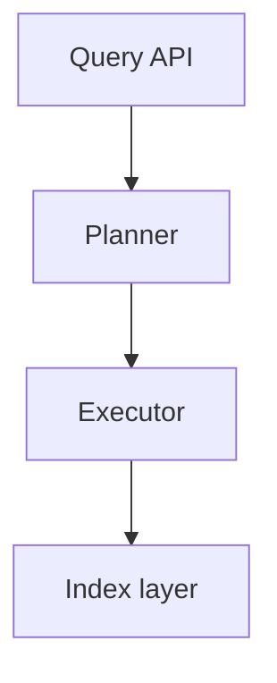

# Structuring larger projects

Status: **implemented** (issue
[#14](https://github.com/rjpower/weaver/issues/14)). This doc surveys how the
field handles spec-driven, multi-step agent work, then argues for a weaver-shaped
answer; the design it argues for now ships. What landed:

- **weaver-core** — a `plan` module (tolerant parser, scaffold, and the
  `diff`/`apply` reconcile that flags-but-never-rewrites in-flight work), a
  `repo_config` module (`.weaver/config.toml` `[plan].dir`), and the
  `issues.plan_task` link column with `issue::list_for_plan` / `set_title`.
- **`weaver` CLI** — `weaver plan new | ls | show | sync [--apply]`, with task
  status projected from the issue ledger.
- **loom** — `GET /api/sessions/{id}/plan`, `POST /api/sessions/{id}/plan/sync`,
  and the `PUT /api/sessions/{id}/file` write primitive; a `SessionPlan`
  component renders the plan on the Overview tab (read-first, projected status,
  dependency graph) with an Edit-in-Monaco mode and Reconcile.

The rest is the original design argument, kept as the rationale of record.

## The problem

A single `loom launch "fix the bug"` is the easy case: one goal, one branch, one
agent, a handful of `weaver issue`s. It falls apart for the
[marin #6178](https://github.com/marin-community/marin/issues/6178)-class task —
a dozen interacting components, work that spans many sessions and days, where the
user's main job is *understanding the shape of the work and steering it*, not
reading code. For those, three things are missing:

1. **A design surface.** A place where the agent lays out the architecture and
   the plan of attack, the user iterates on it until satisfied, and only *then*
   does work begin. Issue #14 calls this the "design loop."
2. **A legible map of state.** Across a fan-out of sessions, the user needs to
   see — at a glance, ideally as a diagram — what the pieces are, how they
   depend on each other, what's done, and *where the next unit of value is*.
3. **Synchronization.** The design and the actual in-flight work must not
   drift. When the user edits the vision, the task set should be re-evaluated
   against it; when work completes, the design's view of state should update.

Issue #14's strawman: agents write a **structured markdown** that encodes both
the design and the task breakdown; tasks execute "in the most appropriate way:
native tasks, workflows, weaver issues etc."; the user iterates on the document
until satisfied, then breaks out into the working session; the document stays
*somehow* synchronized with the real task set, re-evaluated on an explicit
signal.

## TL;DR

1. **Add one new noun: the `plan`** — a single markdown file (not a folder of
   eight) that holds the problem, a `mermaid` architecture diagram, and a task
   breakdown with **stable task IDs**. This is the design surface and the map.
   It is opt-in, for genuinely large work; small tasks stay goal-plus-issues.
2. **Two sources of truth, cleanly split.** The **plan file owns structure**
   (the vision: problem, architecture, the list of tasks and their
   dependencies). The **weaver database owns state** (which tasks are open,
   claimed, closed — i.e. the existing repo-scoped `issues`). Never author live
   status into the file; **project it** from the DB at render time. This single
   rule dissolves the spec-drift problem that the whole field is still fighting.
3. **weaver issues are the materialized task ledger.** Each plan task with
   `exec: session|issue` becomes a repo-scoped issue, linked back to the task by
   a stable `plan/<slug>#T3` key. This reuses — and completes — the fan-out
   that [repo-scoped issues](repo-scoped-issues.md) was built for: the plan is
   the *front end* that authors the N issues you then launch one session each.
4. **Reconciliation is an explicit, agent-driven verb, not a watcher.**
   `weaver plan sync` diffs the file's tasks against the linked issues and
   proposes a delta: create issues for new tasks, close issues for deleted
   tasks, **flag (never silently rewrite) tasks whose work is already
   in-flight.** This is the "design loop ↔ work" sync the issue asks for, in
   weaver's daemon-less, last-write-wins idiom.
5. **loom renders the plan as the project dashboard.** mermaid diagrams,
   tasks sorted by value with live status badges joined from issues, each task
   linking through to its issue → its session → its live terminal. This is the
   "understand and interact with the workflow" surface, built API-first like the
   rest of loom ([[ui-built-on-rest-api]]).

The rest argues each point.

## What the field does (and what to steal)

Spec-driven development (SDD) is the 2025–26 name for "write the spec, let the
agent implement it." Three reference points, then the lessons.

| Tool | Artifacts | Tasks live in | Sync model | Where it hurts |
|---|---|---|---|---|
| **Kiro** (AWS) | `requirements.md` (user stories + EARS criteria), `design.md` (arch + sequence diagrams), `tasks.md` | `tasks.md`, traceable to requirement numbers; dependency "waves" run sequentially, concurrent within a wave | Linear phase gates; no persistent re-anchoring after tasks are cut | **Verbose for small problems** — a one-line bugfix expands into 4 user stories and 16 acceptance criteria |
| **GitHub Spec Kit** | `specs/<branch>/` folder of 8+ files (`spec`, `plan`, `research`, `data-model`, `contracts/`, `tasks`…), a project "constitution", `[NEEDS CLARIFICATION]` markers | `tasks.md`, `[P]`-marked for parallel-safe, grouped by user story | `/specify`→`/plan`→`/tasks`→`/implement`; no defined re-sync after tasks generated | **Review overload** — verbose, repetitive with the code, agent ignores or over-follows |
| **Tessl** | one `*.spec.md` per code file; `@generate`/`@test` tags; generated code stamped `DO NOT EDIT` | implicit in the spec | **Bidirectional** — `tessl build` regenerates code from spec | Model-Driven-Development risk: **inflexibility *and* non-determinism** |

Sources: Martin Fowler's [three-tool comparison](https://martinfowler.com/articles/exploring-gen-ai/sdd-3-tools.html),
[Kiro specs docs](https://kiro.dev/docs/specs/),
[Spec Kit](https://github.com/github/spec-kit) /
[spec-driven.md](https://github.com/github/spec-kit/blob/main/spec-driven.md).

Three lessons jump out, and all three are *weaknesses* the field hasn't solved —
which is exactly where weaver can differentiate:

- **Right-size or die.** Every reviewer's top complaint is ceremony: the
  three-file, eight-file, four-user-stories-for-a-typo tax. None of these tools
  scales *down*. weaver's answer must be opt-in and single-file, and must earn
  its weight only on large work.
- **Pick a single source of truth for *state*, or you get drift.** The
  [spec-kit "evolving specs" debate](https://github.com/github/spec-kit/discussions/152)
  splits into "Master Spec" (one doc reflects current state) vs "Delta" (code is
  truth, specs are per-feature scaffolding) and never resolves it. Tools like
  [Fiberplane Drift](https://github.com/fiberplane/drift) treat it as a *linter*
  problem — anchor docs to code, fail CI when they diverge. The cleaner move is
  architectural: don't let two artifacts claim the same fact. weaver already has
  a live state store (the `issues` table); the plan should never duplicate it.
- **Interactive beats fire-and-forget for long work.** The HITL-orchestration
  literature (Temporal's durable HITL, Microsoft Agent Framework, LangChain)
  converges on: keep the human as a *high-level orchestrator*, persist
  in-flight requests across change, and re-emit them rather than dropping them.
  This is precisely issue #14's complaint about Claude's native workflows —
  "you can stop a workflow, but can't really interact with it." weaver's plan +
  issues + dashboard *is* the durable, interactive layer; native workflows and
  sub-agents become the disposable muscle underneath it.

And one piece of prior art to copy outright: the
[`TODO.md` / GFM task-list](https://github.com/todomd/todo.md) convention —
`- [ ]` / `- [x]`, sections-as-columns, version-controlled, agent-readable. We
adopt the *syntax* but, per the second lesson, render the checkbox state from the
DB rather than letting the agent hand-toggle it.

## The core tension: document vs database

Every SDD tool above keeps tasks **in files** (`tasks.md`). weaver keeps tasks
**in a database** (`issues`, repo-scoped, queryable by the dashboard, claimable
by a branch). That is weaver's whole shape — DB-direct CLI, dashboard as a thin
REST client — and it is *better* than a `tasks.md` for the live-state job:
queryable, concurrent-safe (WAL), survives branch teardown, already drives the
attention/board UI.

But a database is a terrible **design surface**. You cannot sketch an
architecture, embed a `mermaid` diagram, or have a fluid back-and-forth about
*shape* in a table of rows. Markdown is exactly right for that — and it is
already weaver's design-doc culture (this very file).

So the tension isn't "files vs database," it's **"which artifact owns which
fact."** The resolution:

> **The plan file owns the *vision and structure*. The database owns the
> *state*. The rendered view joins them.**

- *Structure* (in the file, git-versioned, diffable, reviewable): the problem
  statement, the architecture diagram, the set of tasks, their descriptions,
  their dependencies, their intended execution strategy, their value/priority.
  This changes when the *design* changes — a human-paced, reviewable event.
- *State* (in the DB): open / claimed-by-branch / closed, who's working it, the
  live session behind it. This changes when *work happens* — a machine-paced,
  high-frequency event.

Hand-authored status in a markdown file is the root cause of spec drift: two
things that must agree, updated by two different actors at two different rates.
Removing that overlap removes the drift by construction. The file never says
"`- [x]` done"; it says "task T3 exists, depends on T1"; the *renderer* asks the
DB "is the issue for T3 closed?" and draws the checkbox.

## The recommended model

### 1. The plan: one file, stable task IDs, a diagram

A single markdown file. The noun is **`plan`** (settled; deliberately not
*spec*, to dodge the EARS/requirements-ceremony connotation). It lives at
`docs/plans/<slug>.md` **by default** — with the code, riding the PR, merging to
`main` as the project's living design doc — but the directory is a **per-repo
setting** (see [Per-repo configuration](#per-repo-configuration)) for teams with
a different convention. A repo can hold **many** plans, one per large effort,
keyed by slug. The file carries frontmatter linking it to the repo:

````markdown
---
plan: search-rewrite
status: draft        # draft → active → done
---

# Search rewrite

## Problem & goal
Free-text prose. Why this, what "done" means.

## Architecture


## Tasks

### T1 — Index layer  `exec: session`  `value: high`  `deps: —`
The storage + read path. Acceptance: ...

### T2 — Executor  `exec: session`  `value: high`  `deps: T1`
...

### T3 — Wire the planner  `exec: workflow`  `value: med`  `deps: T1, T2`
...

## Open questions
- Single-node only for v1?
````

The load-bearing details:

- **Stable task IDs (`T1`, `T2`, …) are the join key.** They are the anchor that
  survives edits, the analog of Kiro's "traceable to requirement numbers" and
  Drift's code anchors. Without a durable ID, every reword of a task heading
  looks to reconciliation like *delete one task, add another* — you'd lose the
  link to its issue and its in-flight session. IDs are assigned once and never
  reused; deleting T2 leaves a gap, it doesn't renumber T3.
- **`exec:` annotates *how* each task runs** — the issue's "most appropriate
  way." `inline` (the planning agent just does it now, no issue), `issue` /
  `session` (materialize a weaver issue; launch a session to claim it),
  `workflow` (a fire-and-forget sub-agent fan-out *within* a session). Only
  `issue`/`session` tasks hit the ledger and the board; `inline` and `workflow`
  are execution detail.
- **`value:` and `deps:` are for the human.** `value` lets the dashboard sort so
  "the areas of maximal value" surface first (issue #14's explicit ask).
  `deps` lets loom draw the task-dependency graph and compute Kiro-style "ready
  now vs blocked" waves.
- **One file, not eight.** The single hardest-won lesson from the field. Prose,
  diagram, and tasks in one reviewable document. Sub-documents
  (`data-model.md`, `research.md`) are allowed but never required.

### 2. weaver issues are the materialized ledger

When the plan goes `active`, every `exec: issue|session` task is materialized
into a repo-scoped issue (the existing model), carrying its link back:

```
issue.plan_task = "search-rewrite#T1"
```

This is the missing front-end for the fan-out that
[repo-scoped issues](repo-scoped-issues.md) was explicitly designed to enable —
"create N issues up front, then launch one session per issue." Today a human
hand-writes those N issues; the plan *generates* them from the design, keeps
them linked, and gives the board something to group by. `loom launch --claim N`
already turns an issue into a session and stamps `claimed_branch`; nothing in
that path changes. The plan just sits one level above it as the index and the
source of the breakdown.

The link runs both ways at render time: the plan view reads each task's issue to
show status; the board can group issues by `plan_task` to show "this backlog
belongs to the search-rewrite plan."

### 3. Reconciliation: the design loop ↔ work, on an explicit signal

The issue: "trigger a re-evaluation of the workitems vs the new vision … as
simple as having the agent query weaver issues & current state vs the document."
Make it a verb:

```
weaver plan sync <slug>     # diff file tasks ⇄ linked issues, print/apply a delta
```

The diff, by task ID:

| File says | DB says | Reconciliation |
|---|---|---|
| Task T7 (new) | no issue | **create** an open issue for T7 |
| no task | issue for T7, **open & unclaimed** | **close** it (removed from the plan) |
| no task | issue for T7, **claimed / in-flight** | **flag, do not touch** — "T7 was deleted from the plan but a session is working it"; raise `attention` |
| title/body changed | issue exists, unclaimed | **update** the issue text |
| title/body changed | issue exists, **claimed** | **flag** — don't yank scope out from under a working agent |

That last-two-rows nuance is the durable-HITL lesson made concrete: **in-flight
work is preserved across a design change and surfaced for a human decision,
never silently rewritten or dropped.** It is also pure weaver idiom — explicit,
daemon-less, last-write-wins, agent-driven, exactly like `set-status`. No file
watcher, no continuous bidirectional codegen (that's the Tessl trap). The user
edits the file, hits **Reconcile** in the dashboard (or the agent runs
`weaver plan sync` after a design conversation), reviews the proposed delta, and
applies it.

### 4. The planning session, then the fan-out

"Iterate on the design loop until satisfied, *then* break out into the working
session." In weaver terms there is no special mode — a **planning session is
just a normal session whose deliverable is the plan file.** You
`loom launch "Plan the search rewrite" --plan search-rewrite`; the agent drafts
`docs/plans/search-rewrite.md`, the user reviews it *through the dashboard*
(rendered, with diagrams) and iterates — asynchronously, the way they already
review everything. Because the agent never blocks on a TUI prompt (per
[WEAVER.md](../crates/weaver-core/WEAVER.md)), the loop is: agent drafts → sets
`attention "plan ready for review"` → user edits the file or comments → agent
reconciles → repeat. When the plan is blessed, `weaver plan sync` materializes
the issues and the human launches the fan-out, one session per high-value task.
The plan file then keeps living as the project's design doc and its status map.

## The interaction surface (loom)

The dashboard is where "understand and interact with the workflow" actually
happens, and it is the payoff for storing structure-in-file / state-in-DB. The
good news after merging #16/#17: **almost the entire renderer already ships.**
`markdown.ts` + `MarkdownView.vue` give GFM markdown, `mermaid` diagrams
(client-side, theme-aware), and `- [ ]`/`- [x]` task lists today; Monaco is
already wired (read-only) in the file browser; the session detail already has a
**Terminal / Overview / Issues / Files** tab bar. So the plan view is mostly
*composition*, not new infrastructure.

**Where it lands: the Overview tab.** A session's Overview is today read-only
context (goal, activity, scratch). For a session whose claimed issue carries a
`plan_task`, render *that plan* at the top of Overview via `MarkdownView` (with
the session's own task highlighted) — the big picture, with "your part" called
out. Sessions with no plan keep today's Overview unchanged.

**Read-first, with a deliberate Edit mode.** Overview's design rule is "the
agent authors, the human reads." The plan is the one principled exception — the
design loop *is* the user editing it — so the affordance must be explicit, not
ambient. Reuse the pattern the file browser already proved: a **preview ⇄ source
toggle**. An **Edit** button swaps the rendered plan for **Monaco in the same
panel** (editable, not the read-only viewer), with **Save** and **Cancel**; Save
writes the file and offers *Reconcile* (the plan's task set may have changed).
This is a mode-flip on one object, not a separate modal or destination — and it
generalizes: the same file-write path makes the Files tab editable for free.

- **Status, projected not authored.** The plan view is `MarkdownView` plus a
  post-render pass that joins each task's `plan_task` to its issue and stamps a
  live badge (open / claimed-by-`<branch>` / closed) — never a stale hand-typed
  checkbox. (v1 can ship the plain render; the badge overlay is step 4.)
- **A task-dependency graph** from `deps:`, nodes colored by status, surfacing
  the critical path and what's unblocked *right now*.
- **Drill-down**: task → its issue → its session → its live terminal/diff. The
  plan becomes the single index into a sprawling fan-out — the thing that's
  missing today when ten sessions are in flight.
- **Actions**: *Reconcile* (`plan sync`, show the delta), *Launch* (per ready
  task → `loom launch --claim`).

The one genuinely new backend piece is a **file-write endpoint** (today
`/sessions/{id}/raw` and `/file` are read-only; Monaco is `readOnly: true`).
Everything lands API-first — a plan read endpoint (parsed + tasks joined to
issue status), a `sync` endpoint, and the file-write endpoint in `web.rs`,
consumed by the SPA and the `loom` CLI alike; the agent-facing `weaver plan`
talks straight to the file + DB. No browser-only state ([[ui-built-on-rest-api]]).

A repo-wide plan board (all plans, not session-scoped) is the natural follow-on
once the per-session Overview render exists — same components, a different route.

## When to use it (right-sizing)

This is the field's unsolved problem, so be explicit: **the plan is opt-in and
for large work only.** Heuristics — reach for a plan when the work will span
multiple sessions/branches, has internal dependencies a diagram would clarify,
or needs user sign-off on shape before code. Otherwise stay with the existing
goal + issues; a typo fix must never cost a `requirements.md`. `loom launch`
stays single-goal by default; `--plan` is the deliberate escalation.

## Non-goals

- **No spec-as-source codegen** (the Tessl path). Plans describe and coordinate;
  they don't generate code that's forbidden to edit. Too rigid, too
  non-deterministic for a general agent.
- **No multi-file spec ceremony** (the Spec Kit `.specify/` path). One file.
- **No continuous file↔DB watcher.** Sync is an explicit verb, matching
  weaver's daemon-less, agent-driven ethos.
- **No new execution engine.** Plans orchestrate the mechanisms that already
  exist (issues, sessions, sub-agent workflows). The plan is the durable,
  interactive *index*; the muscle underneath stays as it is.

## Data, CLI, and API sketch

- **Storage — no `plans` table.** The file is canonical for prose + structure;
  the **only** DB addition is a `plan_task` annotation on `issues`
  (`"<slug>#<id>"`), the link the board groups and joins on. Enumerating plans
  is a filesystem glob of the plan dir in the worktree (loom already reads
  worktree files for the file/raw endpoints), and a plan's task→status is
  parse-the-file + query-issues-by-`plan_task`. A `plans` table would only
  duplicate facts the file and the `issues` rows already own — it earns its
  migration only if repo-wide plan listing ever proves too slow as a glob, which
  at weaver's scale it won't. **Decision: file scan + `plan_task`, no table.**
- **CLI (`weaver`, file+DB direct):**
  `weaver plan new <slug>`, `weaver plan show <slug>`,
  `weaver plan sync <slug> [--apply]`, `weaver plan ls` (glob the plan dir).
- **API (`loom`):** `GET /api/sessions/{id}/plan` (the session's plan, parsed +
  tasks joined to issue status), `POST /api/sessions/{id}/plan/sync`, and a
  **file-write** endpoint (e.g. `PUT /api/sessions/{id}/file`) backing the Edit
  mode — the one new primitive, useful well beyond plans.
- **Launch:** `loom launch --plan <slug>` (planning session);
  reuse `--claim` for the fan-out.

## Per-repo configuration

Issue feedback raised a real gap: the plan directory (and, in time, other
conventions) should be **per-repo**, not a global setting — a vendored repo with
plans under `design/` shouldn't have to reconfigure every clone. weaver already
has the precedent that a repo ships its own `WEAVER.md` to override the builtin;
extend the same idea to a small, repo-committed config file:

```toml
# .weaver/config.toml  (committed; travels with the repo; reviewable)
[plan]
dir = "docs/plans"      # default; override per repo
```

Resolution precedence for such keys: **repo `.weaver/config.toml` → builtin
default.** This is distinct from the existing global `settings` table (machine/
user scope: `agent.default`, `server.auto_adopt`), which stays as-is. `plan.dir`
is simply the first per-repo key; the file is the seed of a mechanism, kept
deliberately minimal (one key) until more conventions actually need it. Open
sub-question only: `.weaver/config.toml` (namespaced dir) vs a flat
`.weaver.toml` — a coin-flip; I lean on the dir for room to grow.

## Incremental delivery

All four steps shipped (✅); the sequence below is how they were staged, each
independently useful.

1. **Plan file + parser + `weaver plan show`.** Just the artifact and a stable
   parse (frontmatter, tasks, IDs, `exec`/`value`/`deps`). No DB changes. Useful
   on day one as a structured scratchpad.
2. **Materialize + link.** `plan_task` on issues; `weaver plan sync` create/close
   only. The fan-out works end to end from a plan.
3. **In-flight flagging.** The "don't clobber claimed work" rules; raise
   `attention`. This is the bit that makes the design loop *safe*.
4. **loom plan view + Edit.** Render the plan on Overview (`MarkdownView`, the
   status-badge overlay, dependency graph, drill-down), plus the file-write
   endpoint and the preview ⇄ Monaco Edit toggle, and the Reconcile/Launch
   actions. The file-write endpoint can land earlier if Files-tab editing is
   wanted sooner.

Each step is independently shippable and independently useful.

## Resolved decisions (issue #14 feedback)

- **Noun:** `plan`. ✅
- **Location:** `docs/plans/<slug>.md` by default, **per-repo configurable** via
  `.weaver/config.toml` `[plan].dir`. ✅
- **Plans per repo:** **many**, slug-keyed, each spanning its own fan-out. ✅
- **`plans` DB row:** **no** — file scan for enumeration, `plan_task` on issues
  for the link/status join. The file and `issues` already own every fact a table
  would hold. ✅
- **Dashboard editing:** read-first on the **Overview** tab with an explicit
  **Edit** button that flips the rendered plan to **Monaco** in-place (Save +
  Cancel, then offer Reconcile) — reusing the file browser's proven preview ⇄
  source pattern. Needs one new backend primitive: a file-write endpoint. ✅

Remaining minor sub-question: `.weaver/config.toml` vs flat `.weaver.toml`
(cosmetic), and optimistic-concurrency handling if the agent rewrites the plan
while a human has it open in Monaco (a "file changed on disk" guard on Save —
noted, not over-built).

## Sources

- Martin Fowler — [Understanding SDD: Kiro, spec-kit, Tessl](https://martinfowler.com/articles/exploring-gen-ai/sdd-3-tools.html)
- [Kiro specs documentation](https://kiro.dev/docs/specs/)
- GitHub [Spec Kit](https://github.com/github/spec-kit) and [spec-driven.md](https://github.com/github/spec-kit/blob/main/spec-driven.md); the [evolving-specs discussion](https://github.com/github/spec-kit/discussions/152)
- [Spec-driven development with AI (GitHub Blog)](https://github.blog/ai-and-ml/generative-ai/spec-driven-development-with-ai-get-started-with-a-new-open-source-toolkit/)
- Addy Osmani — [How to write a good spec for AI agents](https://addyosmani.com/blog/good-spec/)
- [Fiberplane Drift](https://github.com/fiberplane/drift) — anchoring docs to code, drift-as-linter
- [TODO.md format](https://github.com/todomd/todo.md) and GitHub [task lists](https://docs.github.com/en/get-started/writing-on-github/working-with-advanced-formatting/about-tasklists)
- Temporal — [durable human-in-the-loop](https://learn.temporal.io/tutorials/ai/building-durable-ai-applications/human-in-the-loop/); [Microsoft Agent Framework HITL](https://learn.microsoft.com/en-us/agent-framework/workflows/human-in-the-loop)
